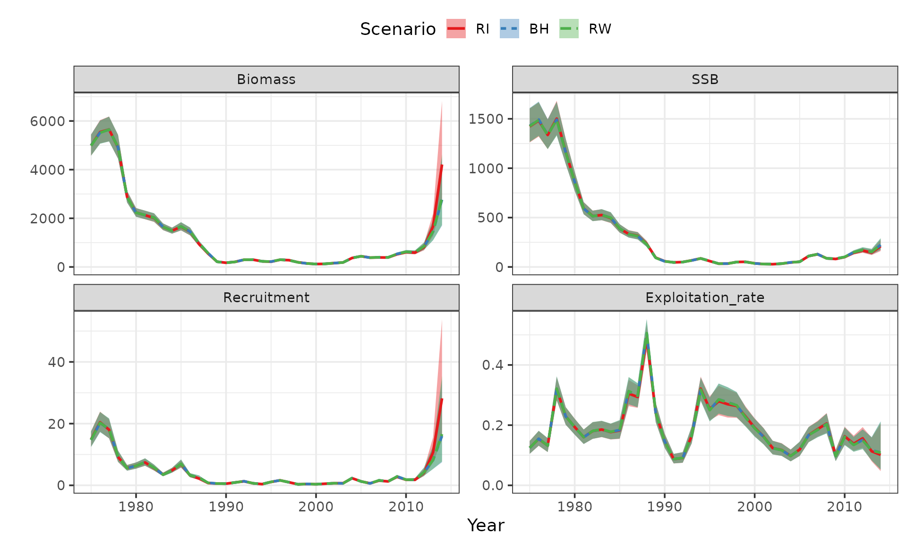
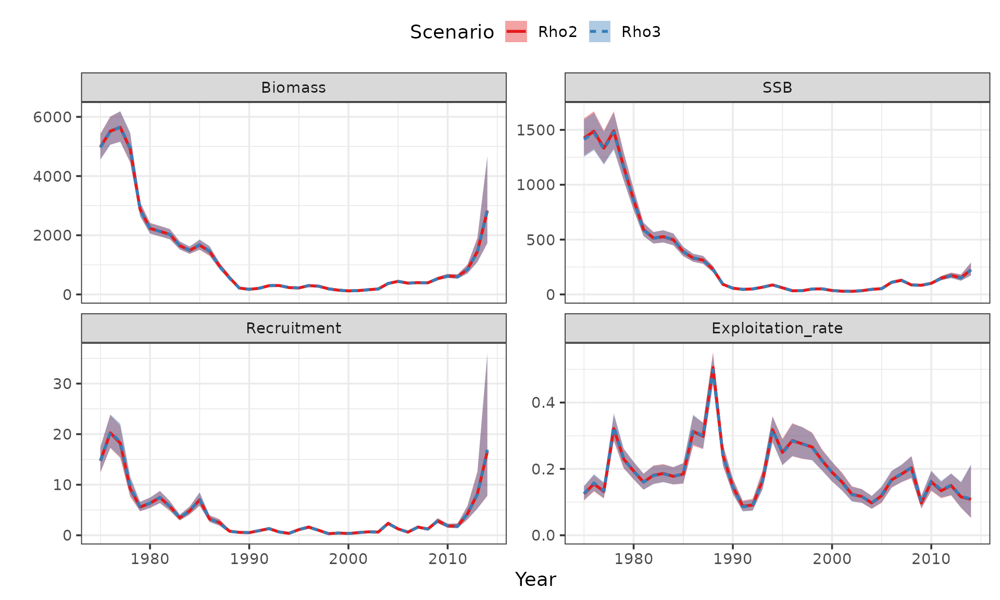
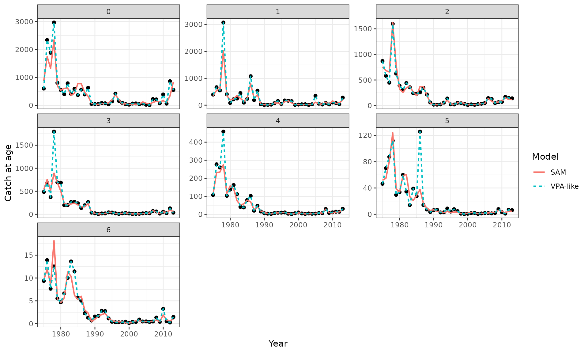
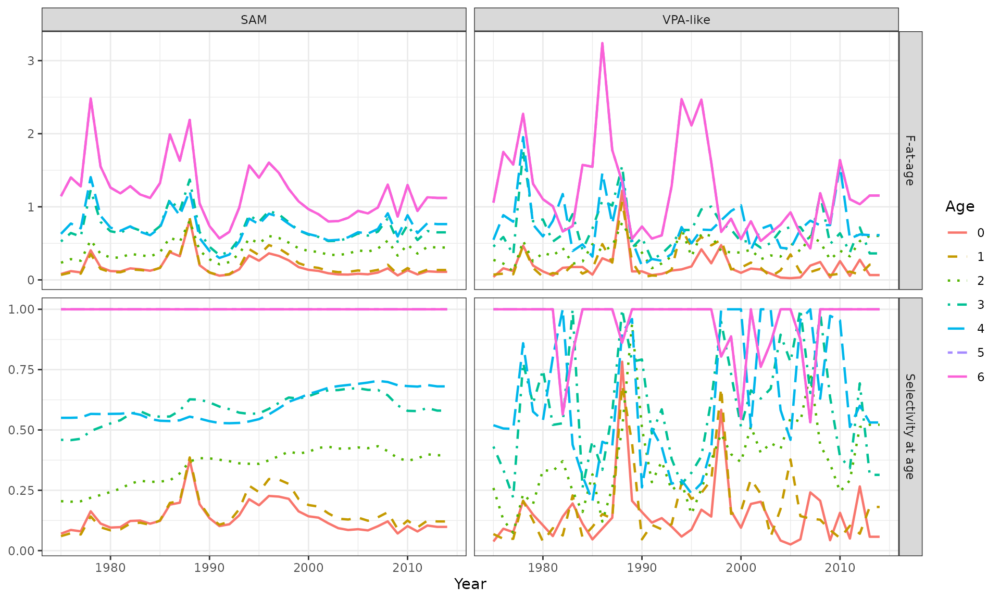
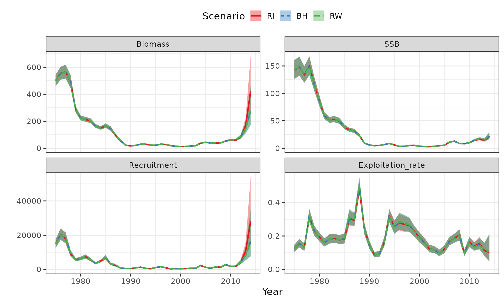
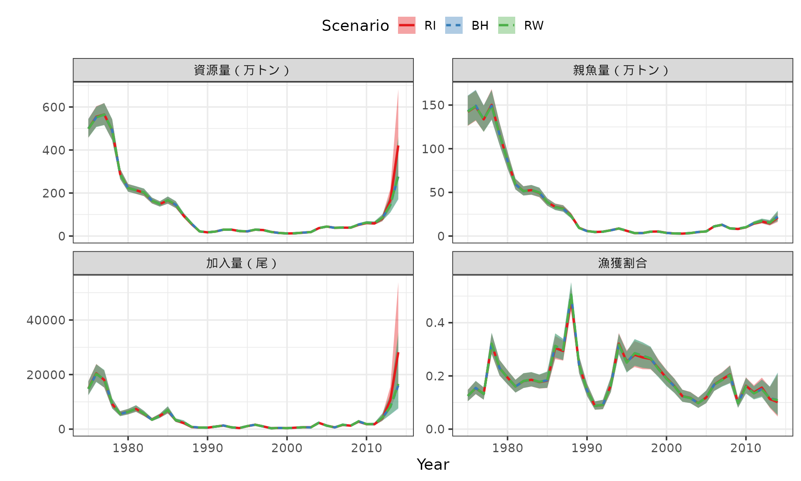

# FAQ on how to use 'frasam'

## Frequently Asked Questions

この文書は、`frasam`
を使うときによくある質問・要望と対応方針をまとめるためのものです。
解析の詳細な手順は通常のvignetteに残し、ここではエラー対応、確認方法、開発時の注意点を短く整理します。
ここに載せてほしい項目は、[Issues](https://github.com/ShotaNishijima/frasam/issues)に書き込んでください。あるいは、ニシジマまで連絡してください。

### インストールと依存パッケージ

#### どのブランチを`frasam` を使えばよい？

- このvignetteにある仕様を使う場合は`frasam` は
  `create_vignette`のブランチをインストールしてください

``` r

install.packages("remotes")
remotes::install_github("ShotaNishijima/frasyr@create_vignette")
# remotes::install_github("ShotaNishijima/frasyr@dev")

library(frasam)
```

#### `frasyr` がないと言われます

`frasam` は `frasyr` に依存しています。未インストールの場合は、開発版の
`frasyr` を入れてから再実行してください。

``` r

remotes::install_github("ichimomo/frasyr@dev")
```

### SAMの実行

#### `use_sam_tmb()` はいつ実行しますか？

- [`sam()`](https://shotanishijima.github.io/frasam/reference/sam.md)
  を実行する前に、TMBで使う実行ファイルを準備するために実行します。
- 通常のテストや例では、上書きしない設定にします。

``` r

use_sam_tmb(overwrite = FALSE)
#> [1] TRUE
```

#### 一部の引数のみを変更して解析したい

- SAMの結果オブジェクトに格納されている`input`を使って、前までの設定を引き継いだ解析ができます
- ここでは再生産関係を変更した場合を例に説明します。

``` r

data("dat_ex") #example data

#Random walk (RW)
res_rw  <- sam(
  dat_ex,
  last.catch.zero = TRUE, #最終年のcatchがzeroかどうか
  abund = c("N","N","N","SSB","B"),
  min.age=c(0,0,1,0,0),
  max.age = c(0,0,1,6,6),
  rec.age = 0,
  index.key=0:4, #すべてのindexの観測誤差のSDが異なる、という設定
  b.est=FALSE,
  SR = "RW",
  varC = c(0,0,1,1,1,2,2), #0-1歳, 2-4歳, 5-6+歳でcatch at ageの観測誤差のSDが共通
  varF = c(0,0,1,1,1,1,1), #0-1歳, 2-6+歳でF at ageの過程誤差のSDが共通
  varN = c(0,1,1,1,1,1,1), #0歳, 1-6+歳でN at ageの過程誤差のSDが共通
  rho.mode=3,
  bias.correct = FALSE,
  silent = TRUE
)

# RW -> BH
input <- res_rw$input
input$SR <- "BH"
res_bh <- do.call(sam, input)

# RW -> RI
input$SR <- "RI"
res_ri <- do.call(sam, input)

plot_samvpa(list(res_rw,res_bh,res_ri), CI=0.8,
            scenario_name=rev(c("RW","BH","RI")))
```



#### 引数の形式がデータと合っていないことによるエラーを修正したい

[`sam()`](https://shotanishijima.github.io/frasam/reference/sam.md)
では、`q.init` などの初期値や `p0.list`
の構造が現在のデータ・モデル設定と合っていない場合、TMB
に渡す前にエラーとして止まります。
この場合は、エラーメッセージに出ている引数の長さや構造を、現在の解析設定に合わせて修正します。

例えば、`q.init` は index の数と同じ長さで与える必要があります。
以下では、あえて 1 つ長い `q.init` を与えてエラーにしています。

``` r

bad_input <- res_ri$input
bad_input$p0.list <- NULL
bad_input$q.init <- rep(1, length(bad_input$abund) + 1)

res_bad_q <- do.call(sam, bad_input)
#> Error:
#> ! 'q.init' must have length 5, but length 6 was supplied.
```

`bad_input$abund` の長さが index の数なので、`q.init`
も同じ長さに直します。 特に初期値を指定する必要がなければ、`NULL`
に戻してデフォルト初期値を使うのも安全です。

``` r

fixed_input <- bad_input
fixed_input$q.init <- rep(1, length(fixed_input$abund))

res_fixed_q <- do.call(sam, fixed_input)
length(res_fixed_q$input$q.init)
#> [1] 5
length(res_fixed_q$input$abund)
#> [1] 5
```

以前の解析結果を初期値として使う場合は、`p0.list`
の各パラメータの名前・長さ・次元が、現在のモデル設定と一致している必要があります。
以下では、`logQ` だけをあえて 1
つ長くして、構造が合わない例を作っています。

``` r

bad_input <- res_ri$input
bad_input$p0.list <- res_ri$init
bad_input$p0.list$logQ <- c(bad_input$p0.list$logQ, 0)

res_bad_p0 <- do.call(sam, bad_input)
#> Error:
#> ! 'p0.list' does not match the current model parameter structure:
#> - logQ has length 6; expected 5
```

このような場合は、壊れた要素だけを手で直すより、同じモデル構造から得られた
`init` や `par_list` を使い直すのが安全です。
モデル構造を変えた場合は、`p0.list <- NULL`
としてデフォルト初期値から再実行してください。

``` r

fixed_input <- bad_input
fixed_input$p0.list <- res_ri$init

res_fixed_p0 <- do.call(sam, fixed_input)
length(res_fixed_p0$init$logQ)
#> [1] 5
length(res_fixed_p0$input$abund)
#> [1] 5
```

モデル設定を変えた後に以前の推定値を初期値として使いたい場合は、まず
`p0.list <- NULL` で一度実行し、その結果の `par_list` や `init`
を次の解析に使うと、構造の不一致を避けやすくなります。

#### モデルがちゃんと収束しているか判別したい

[`check_fit_sam()`](https://shotanishijima.github.io/frasam/reference/check_fit_sam.md)
を使うと、[`sam()`](https://shotanishijima.github.io/frasam/reference/sam.md)
の結果について、収束コード、Hessian、勾配、標準誤差、極端なパラメータ値などをまとめて確認できます。
返り値の `ok` が `TRUE` なら、基本的な診断項目はすべて通っています。

``` r

fit_check <- check_fit_sam(res_rw)
#>                          check    ok              value       threshold
#>          optimizer convergence  TRUE                  0               0
#>      positive definite Hessian FALSE              FALSE            TRUE
#>  maximum fixed-effect gradient  TRUE          6.795e-06            0.01
#>    finite fixed effects and SE FALSE              17/18             all
#>        maximum fixed-effect SE  TRUE             0.6787             Inf
#>  maximum absolute fixed effect  TRUE              9.788             Inf
#>           reported sigma range FALSE 5.612e-05 to 1.373     1e-04 to 10
#>             reported rho range  TRUE   0.9796 to 0.9796 1e-04 to 0.9999
#>  parameters near finite bounds  TRUE                  0               0
#>                                                                         message
#>                                                   nlminb convergence code is 0.
#>                                         sdreport does not report pdHess = TRUE.
#>                                         Maximum absolute fixed-effect gradient.
#>                    Fixed-effect estimates and standard errors should be finite.
#>                         Large standard errors can indicate weak identification.
#>      Extremely large internal-scale estimates can indicate weak identification.
#>  Reported standard deviations should be finite and within the diagnostic range.
#>                 Rho values very close to 0 or 1 can indicate boundary behavior.
#>                   Only checked when finite lower or upper bounds were supplied.

fit_check$ok
#> [1] FALSE
fit_check$checks
#>                           check    ok              value       threshold
#> 1         optimizer convergence  TRUE                  0               0
#> 2     positive definite Hessian FALSE              FALSE            TRUE
#> 3 maximum fixed-effect gradient  TRUE          6.795e-06            0.01
#> 4   finite fixed effects and SE FALSE              17/18             all
#> 5       maximum fixed-effect SE  TRUE             0.6787             Inf
#> 6 maximum absolute fixed effect  TRUE              9.788             Inf
#> 7          reported sigma range FALSE 5.612e-05 to 1.373     1e-04 to 10
#> 8            reported rho range  TRUE   0.9796 to 0.9796 1e-04 to 0.9999
#> 9 parameters near finite bounds  TRUE                  0               0
#>                                                                          message
#> 1                                                  nlminb convergence code is 0.
#> 2                                        sdreport does not report pdHess = TRUE.
#> 3                                        Maximum absolute fixed-effect gradient.
#> 4                   Fixed-effect estimates and standard errors should be finite.
#> 5                        Large standard errors can indicate weak identification.
#> 6     Extremely large internal-scale estimates can indicate weak identification.
#> 7 Reported standard deviations should be finite and within the diagnostic range.
#> 8                Rho values very close to 0 or 1 can indicate boundary behavior.
#> 9                  Only checked when finite lower or upper bounds were supplied.
```

`verbose = FALSE`
を指定すると、実行時に表を表示せず、結果だけをオブジェクトとして保存できます。
複数のモデルを比較するときは、`ok` や `checks` を取り出して使います。

``` r

fit_checks <- list(
  RW = check_fit_sam(res_rw, verbose = FALSE),
  BH = check_fit_sam(res_bh, verbose = FALSE),
  RI = check_fit_sam(res_ri, verbose = FALSE)
)

sapply(fit_checks, function(x) x$ok)
#>    RW    BH    RI 
#> FALSE FALSE FALSE
```

特定の診断だけを詳しく見たい場合は、`checks` から該当行を取り出します。
例えば、最大勾配や Hessian の状態は以下のように確認できます。

``` r

fit_check$checks[
  fit_check$checks$check %in% c(
    "maximum fixed-effect gradient",
    "positive definite Hessian",
    "reported sigma range"
  ),
]
#>                           check    ok              value   threshold
#> 2     positive definite Hessian FALSE              FALSE        TRUE
#> 3 maximum fixed-effect gradient  TRUE          6.795e-06        0.01
#> 7          reported sigma range FALSE 5.612e-05 to 1.373 1e-04 to 10
#>                                                                          message
#> 2                                        sdreport does not report pdHess = TRUE.
#> 3                                        Maximum absolute fixed-effect gradient.
#> 7 Reported standard deviations should be finite and within the diagnostic range.
```

`fixed`
には固定効果パラメータごとの推定値、標準誤差、勾配が入っています。
標準誤差が大きいパラメータや、勾配が大きいパラメータを確認したいときに使います。

``` r

head(fit_check$fixed)
#>           name   estimate         se      gradient
#> 1         logQ -5.3393468 0.17712387 -9.534776e-07
#> 2         logQ -4.7404500 0.21984587  7.940808e-07
#> 3         logQ -5.5526326 0.08309909 -4.086623e-06
#> 4         logQ  0.3089114 0.06075810  3.044420e-06
#> 5         logQ -4.0119936 0.11963056 -2.135708e-06
#> 6 logSdLogFsta -0.4669702 0.16208347 -1.079564e-06

fit_check$fixed[
  order(abs(fit_check$fixed$gradient), decreasing = TRUE),
][1:5, ]
#>            name    estimate         se      gradient
#> 13  logSdLogObs  0.09393634 0.11460027 -6.795203e-06
#> 14  logSdLogObs  0.31697774 0.11343008  6.336297e-06
#> 3          logQ -5.55263262 0.08309909 -4.086623e-06
#> 7  logSdLogFsta -1.16227806 0.15671268  3.722154e-06
#> 4          logQ  0.30891139 0.06075810  3.044420e-06
```

診断のしきい値は引数で変更できます。 例えば、勾配をより厳しく見る場合は
`gradient_tol` を小さくします。

``` r

check_fit_sam(res_rw, gradient_tol = 1e-4, verbose = FALSE)$checks
#>                           check    ok              value       threshold
#> 1         optimizer convergence  TRUE                  0               0
#> 2     positive definite Hessian FALSE              FALSE            TRUE
#> 3 maximum fixed-effect gradient  TRUE          6.795e-06           1e-04
#> 4   finite fixed effects and SE FALSE              17/18             all
#> 5       maximum fixed-effect SE  TRUE             0.6787             Inf
#> 6 maximum absolute fixed effect  TRUE              9.788             Inf
#> 7          reported sigma range FALSE 5.612e-05 to 1.373     1e-04 to 10
#> 8            reported rho range  TRUE   0.9796 to 0.9796 1e-04 to 0.9999
#> 9 parameters near finite bounds  TRUE                  0               0
#>                                                                          message
#> 1                                                  nlminb convergence code is 0.
#> 2                                        sdreport does not report pdHess = TRUE.
#> 3                                        Maximum absolute fixed-effect gradient.
#> 4                   Fixed-effect estimates and standard errors should be finite.
#> 5                        Large standard errors can indicate weak identification.
#> 6     Extremely large internal-scale estimates can indicate weak identification.
#> 7 Reported standard deviations should be finite and within the diagnostic range.
#> 8                Rho values very close to 0 or 1 can indicate boundary behavior.
#> 9                  Only checked when finite lower or upper bounds were supplied.
```

`reported sigma range` が `FALSE` になった場合は、`sigma`
テーブルを見ると、どの種類・何番目の sigma
がしきい値の外にあるかを確認できます。

``` r

fit_check$sigma
#>             type index        value    ok   problem
#> 1          sigma     1 1.0984898146  TRUE          
#> 2          sigma     2 1.3729720116  TRUE          
#> 3          sigma     3 0.4887155303  TRUE          
#> 4          sigma     4 0.3385309609  TRUE          
#> 5          sigma     5 0.7328951790  TRUE          
#> 6     sigma.logC     1 0.5552486816  TRUE          
#> 7     sigma.logC     2 0.5552486816  TRUE          
#> 8     sigma.logC     3 0.2702569865  TRUE          
#> 9     sigma.logC     4 0.2702569865  TRUE          
#> 10    sigma.logC     5 0.2702569865  TRUE          
#> 11    sigma.logC     6 0.4575531134  TRUE          
#> 12    sigma.logC     7 0.4575531134  TRUE          
#> 13 sigma.logFsta     1 0.6268987810  TRUE          
#> 14 sigma.logFsta     2 0.6268987810  TRUE          
#> 15 sigma.logFsta     3 0.3127728525  TRUE          
#> 16 sigma.logFsta     4 0.3127728525  TRUE          
#> 17 sigma.logFsta     5 0.3127728525  TRUE          
#> 18 sigma.logFsta     6 0.3127728525  TRUE          
#> 19 sigma.logFsta     7 0.3127728525  TRUE          
#> 20    sigma.logN     1 0.6279343136  TRUE          
#> 21    sigma.logN     2 0.0000561208 FALSE too small
#> 22    sigma.logN     3 0.0000561208 FALSE too small
#> 23    sigma.logN     4 0.0000561208 FALSE too small
#> 24    sigma.logN     5 0.0000561208 FALSE too small
#> 25    sigma.logN     6 0.0000561208 FALSE too small
#> 26    sigma.logN     7 0.0000561208 FALSE too small

fit_check$sigma[!fit_check$sigma$ok, ]
#>          type index       value    ok   problem
#> 21 sigma.logN     2 5.61208e-05 FALSE too small
#> 22 sigma.logN     3 5.61208e-05 FALSE too small
#> 23 sigma.logN     4 5.61208e-05 FALSE too small
#> 24 sigma.logN     5 5.61208e-05 FALSE too small
#> 25 sigma.logN     6 5.61208e-05 FALSE too small
#> 26 sigma.logN     7 5.61208e-05 FALSE too small
```

しきい値を変えて確認したい場合は、`sigma_range` を指定します。
例えば、以下では説明用にかなり狭い範囲を指定しています。

``` r

fit_check_strict_sigma <- check_fit_sam(
  res_rw,
  sigma_range = c(0.5, 1),
  verbose = FALSE
)

fit_check_strict_sigma$checks[
  fit_check_strict_sigma$checks$check == "reported sigma range",
]
#>                  check    ok              value threshold
#> 7 reported sigma range FALSE 5.612e-05 to 1.373  0.5 to 1
#>                                                                          message
#> 7 Reported standard deviations should be finite and within the diagnostic range.

fit_check_strict_sigma$sigma[!fit_check_strict_sigma$sigma$ok, ]
#>             type index        value    ok   problem
#> 1          sigma     1 1.0984898146 FALSE too large
#> 2          sigma     2 1.3729720116 FALSE too large
#> 3          sigma     3 0.4887155303 FALSE too small
#> 4          sigma     4 0.3385309609 FALSE too small
#> 8     sigma.logC     3 0.2702569865 FALSE too small
#> 9     sigma.logC     4 0.2702569865 FALSE too small
#> 10    sigma.logC     5 0.2702569865 FALSE too small
#> 11    sigma.logC     6 0.4575531134 FALSE too small
#> 12    sigma.logC     7 0.4575531134 FALSE too small
#> 15 sigma.logFsta     3 0.3127728525 FALSE too small
#> 16 sigma.logFsta     4 0.3127728525 FALSE too small
#> 17 sigma.logFsta     5 0.3127728525 FALSE too small
#> 18 sigma.logFsta     6 0.3127728525 FALSE too small
#> 19 sigma.logFsta     7 0.3127728525 FALSE too small
#> 21    sigma.logN     2 0.0000561208 FALSE too small
#> 22    sigma.logN     3 0.0000561208 FALSE too small
#> 23    sigma.logN     4 0.0000561208 FALSE too small
#> 24    sigma.logN     5 0.0000561208 FALSE too small
#> 25    sigma.logN     6 0.0000561208 FALSE too small
#> 26    sigma.logN     7 0.0000561208 FALSE too small
```

#### 以前の解析結果の初期値を利用したい

\-`par_list`に固定効果とランダム効果のパラメータ推定値がリスト形式で与えられている -
これを次の解析の初期値として使うことで、推定を安定化させることができる -
ただし、固定効果とランダム効果の数や構造が変わるとうまく行かないので、注意すること -
ここでは`rho.mode`を変更したときを例に説明する

``` r


input$p0.list <- res_ri$par_list
input$rho.mode <- 2
res_rho2 <- do.call(sam, input)

plot_samvpa(list(res_ri, res_rho2), CI=0.8,
            scenario_name=rev(c("Rho3","Rho2")))
```



#### 初期値を設定する方法

収束しにくい場合や、勾配がやや大きい場合は、初期値を変更して再解析することが有効な場合があります。
[`sam()`](https://shotanishijima.github.io/frasam/reference/sam.md)
では、主な固定効果パラメータの初期値を `xx.init`
という引数で指定できます。 これらの引数は、内部で
[`log()`](https://rdrr.io/r/base/Log.html) や `logit()`
に変換されるため、基本的には通常のスケールで値を与えます。

- `q.init`: index ごとの q の初期値。長さは index の数と同じにします
- `sdFsta.init`: F のランダムウォークのプロセス誤差 SD の初期値。長さは
  `unique(varF)` の数と対応します
- `sdLogN.init`: 資源尾数 N のプロセス誤差 SD の初期値。長さは
  `unique(varN)` の数と対応します
- `sdLogObs.init`: catch at age と index の観測誤差 SD の初期値。長さは
  `unique(varC)` と `unique(index.key)` を合わせた数と対応します
- `rho.init`: F
  のランダムウォークの年齢間相関係数の初期値。0から1の間の値を指定します
- `a.init`, `b.init`: 再生産関係パラメータの初期値。正の値を指定します

例えば、VPAで得られた q を `q.init`
として使う場合は、以下のように指定します。

``` r


# last catch zeroのとき最終年の加入IndexがあるとInfがでるとqが推定できないので除いておく
dat_ex2 <- dat_ex
dat_ex2$index[1:2,ncol(dat_ex2$index)] <- NA_real_

res_vpa <- frasyr::vpa(
  dat_ex2,
  last.catch.zero = TRUE,
  fc.year=2011:2013,
  tf.year = 2010:2012,
  term.F="max",
  stat.tf="mean",
  Pope=TRUE,
  tune=TRUE,
  p.init=0.5, 
  abund = c("N","N","N","SSB","B"),
  min.age=c(0,0,1,0,0),
  max.age = c(0,0,1,6,6), 
  sel.update=TRUE)

q_init <- res_vpa$q #VPAの推定値を持ってくる
input <- res_rw$input
input$q.init <- q_init

res_qinit <- do.call(sam,input)
```

#### 初期値をランダムに変えてよい解を探したい

初期値に依存して局所解に入っている可能性がある場合は、[`do_jitter()`](https://shotanishijima.github.io/frasam/reference/do_jitter.md)
で初期値をランダムに少しずつ変えて、複数回推定することができます。
[`do_jitter()`](https://shotanishijima.github.io/frasam/reference/do_jitter.md)
は各試行の目的関数値を `resdat` に保存します。
同じモデル・同じデータで比較する場合は、`obj_value`
が小さいものを、尤度が高い解として選びます。 `ID = 0` は jitter
する前の元の結果を表します。 `ID > 0`
が選ばれた場合は、初期値を変えることで目的関数値が改善したことを意味します。
ただし、[`do_jitter()`](https://shotanishijima.github.io/frasam/reference/do_jitter.md)
の `reslist`
に保存される結果は、[`sam()`](https://shotanishijima.github.io/frasam/reference/sam.md)
の完全な出力ではなく、目的関数値の比較に使う簡易的な結果です。
通常の図や出力には、改めて
[`sam()`](https://shotanishijima.github.io/frasam/reference/sam.md)
の結果オブジェクトを使ってください。

``` r

jitter_res <- do_jitter(
  res_rw,
  SD = 0.1,   # 初期値に加える正規乱数の標準偏差
  nsim = 20,  # jitterする回数
  seed = 1
)

jitter_res$resdat

best_id <- jitter_res$resdat$ID[which.min(jitter_res$resdat$obj_value)]
best_id

if (best_id == 0) {
    res_best <- res_rw
  } else {
    input <- res_rw$input
    input$p0.list <- jitter_res$reslist[[best_id]]$obj$env$parList()
    res_best <- do.call(sam, input)
  }
```

#### 資源尾数Nのプロセス誤差を小さい値に固定したい

- SAMではVPAと異なり、加入以降の個体数が、漁獲死亡(F)と自然死亡係数(M)以外の要因（プロセス誤差）によっても変化することを仮定します
- その値を小さくすることで、VPAと同じ個体群動態になります
- 上の診断例のように、`sigma.logN`
  が極端に小さい場合は、以下の設定で1歳以上のsigma.logNを小さい値で固定して、推定しないことが推奨されます
- `varN.fix = c(NA, 0.0001)`のように引数を設定してください。NAは0歳（加入）を推定すること、1歳魚以上の過程誤差の分散を0.0001に固定することを意味しています。
- 設定するのはSDではなく分散であることに注意してください。つまり0.0001とするとSDは0.01で固定されます
- `varN.fix`の長さは、`unique(varN)`の長さと一致しなくてはいけません

``` r


input <- res_rw$input
input$varN #1歳魚以上が共通
#> [1] 0 1 1 1 1 1 1
input$varN.fix <- c(NA,0.0001) #SDではなくて分散

res_varNfix = do.call(sam, input)
res_varNfix$sigma.logN #1歳魚以上はSD=0.01に固定
#> [1] 0.6276352 0.0100000 0.0100000 0.0100000 0.0100000 0.0100000 0.0100000

check_fit_sam(res_varNfix, verbose = TRUE) #すべてOKになる
#>                          check   ok            value       threshold
#>          optimizer convergence TRUE                0               0
#>      positive definite Hessian TRUE             TRUE            TRUE
#>  maximum fixed-effect gradient TRUE        0.0003751            0.01
#>    finite fixed effects and SE TRUE            17/17             all
#>        maximum fixed-effect SE TRUE           0.6788             Inf
#>  maximum absolute fixed effect TRUE            5.553             Inf
#>           reported sigma range TRUE    0.01 to 1.373     1e-04 to 10
#>             reported rho range TRUE 0.9796 to 0.9796 1e-04 to 0.9999
#>  parameters near finite bounds TRUE                0               0
#>                                                                         message
#>                                                   nlminb convergence code is 0.
#>                                                 sdreport reports pdHess = TRUE.
#>                                         Maximum absolute fixed-effect gradient.
#>                    Fixed-effect estimates and standard errors should be finite.
#>                         Large standard errors can indicate weak identification.
#>      Extremely large internal-scale estimates can indicate weak identification.
#>  Reported standard deviations should be finite and within the diagnostic range.
#>                 Rho values very close to 0 or 1 can indicate boundary behavior.
#>                   Only checked when finite lower or upper bounds were supplied.
```

#### ある固定効果パラメータをある値に固定して使いたい

- 上記で説明したNの過程誤差以外にも、他のパラメータを固定したい場合があるかもしれない
- 例えば、catch at
  ageの観測誤差の分散が事前に分かっている場合はその値を固定することは妥当だと思われる
- TMBでは`map`という機能を使って、固定効果パラメータを初期値に固定できる機能がある
- `sam`では`map.add`という引数を利用することで、特定のパラメータを固定できる
- SAMではcatch at
  ageの観測誤差とIndexの観測誤差（のSDのlog）が共にlogSdLogObsというパラメータで推定されているので、その場所を見つける必要がある

``` r

input <- res_varNfix$input

# 現在の推定値を次の初期値に使う
input$p0.list <- res_varNfix$par_list

# 有効桁数の違いで match() が NA になることがあるので、
# 許容誤差つきで一番近い位置を探す関数を用意する
find_pos <- function(x, target, tol = 1e-6) {
  pos <- which(abs(x - target) < tol)
  if (length(pos) == 0) {
    pos <- which.min(abs(x - target))
  }
  pos[1]
}

# logSdLogObs は log スケールだが、確認しやすいように SD スケールで比較する
sigma_hat <- exp(input$p0.list$logSdLogObs)

# sigma.logC に対応する logSdLogObs の位置を探す
idx_logC <- sapply(unique(res_varNfix$sigma.logC), function(z) {
  find_pos(sigma_hat, z, tol = 1e-6)
})

idx_logC
#> [1] 1 2 3
sigma_hat[idx_logC]
#> [1] 0.5552559 0.2700808 0.4574299
exp(input$p0.list$logSdLogObs[idx_logC])
#> [1] 0.5552559 0.2700808 0.4574299

# 例: すべてのsigma.logCを 0.2 に固定する
fix_pos <- idx_logC[]

# map は、推定するパラメータには番号、固定するパラメータには NA を入れる
map_logSdLogObs <- seq_along(input$p0.list$logSdLogObs)
map_logSdLogObs[fix_pos] <- NA

# 固定したい値を初期値として入れる（logをとること）
input$p0.list$logSdLogObs[fix_pos] <- log(0.2)
input$map.add <- list(logSdLogObs = factor(map_logSdLogObs))

res_sigma02 <- do.call(sam, input)

# 固定したグループが 0.2 になっていることを確認する
res_sigma02$sigma.logC
#> [1] 0.2 0.2 0.2 0.2 0.2 0.2 0.2
abs(res_sigma02$sigma.logC - 0.2) < 1e-6
#> [1] TRUE TRUE TRUE TRUE TRUE TRUE TRUE

# 固定したパラメータは opt$par には出てこない
res_sigma02$opt$par[names(res_sigma02$opt$par) == "logSdLogObs"]
#> logSdLogObs logSdLogObs logSdLogObs logSdLogObs logSdLogObs 
#>   0.1326099   0.3298195  -0.6822912  -1.0575798  -0.2981344
```

#### VPAと同じような設定で解析したい

- SAMで、VPAの仮定を同じような設定をすることによって、VPAのようなモデルを解析することができる
- ①年齢別漁獲尾数の観測誤差を小さくする、②1歳魚以上の資源尾数の過程誤差を小さくする、③FのRandom
  walkにおける年齢間の相関をゼロにし、各年齢の観測誤差のSDを（なるべく）別々に推定する、ことによって、VPAの仕様に近づけることになります。
- ①については、`varC`, `sdLogObs.init`, `map.add`
  を以下のようにすることで実行できます（[ある固定効果パラメータをある値に固定して使いたい](#fix-SDlogC)も参照のこと）
- ②については、`varN`, `varN.fix`
  を以下のように設定してください（[資源尾数Nのプロセス誤差を小さい値に固定したい](#fix-SDlogN)も参照のこと）
- ③については、`varF`, `rho.mode`を以下のように設定してください
- ここではやっていませんが、上記の設定のon/offを組み合わせることで、catch
  at ageの観測誤差、1歳魚以上の過程誤差,
  Fのランダムウォークに相対的影響を評価することもできるかと思います

``` r

res_vpalike  <- sam(
  dat_ex,
  last.catch.zero = TRUE, #最終年のcatchがzeroかどうか
  abund = c("N","N","N","SSB","B"),
  min.age=c(0,0,1,0,0),
  max.age = c(0,0,1,6,6),
  rec.age = 0,
  index.key=0:4,
  b.est=FALSE,
  SR = "RW",
  varC = c(0,0,0,0,0,0,0), #すべての年齢で観測誤差が共通
  sdLogObs.init = c(0.01, rep(0.5, nrow(dat_ex$index))), #catch at ageのSDの初期値0.01とし、Indexについては0.5とする
  map.add = list(logSdLogObs = factor(c(NA,1:rep(nrow(dat_ex$index))))),　#catch at ageのSDのみmapで初期値に固定する
  varN = c(0,1,1,1,1,1,1),
  varN.fix = c(NA,0.0001),
  varF = c(0,1,2,3,4,5,5), #年齢別に推定するが、最高齢とその1歳前は同じ数字にしてください（収束しない場合は共通する）
  rho.mode=0, #Fのrandom wallk process errorの年齢間の相関なし
  bias.correct = FALSE,
  silent = TRUE
)

check_fit_sam(res_vpalike, verbose = FALSE)

res_vpalike$sigma.logC #Catch at ageの観測誤差が小さくなっていることを確認
#> [1] 0.01 0.01 0.01 0.01 0.01 0.01 0.01
# res_vpalike$sigma.logF

res_vpalike$sigma.logN #N at age 1+の仮定誤差が小さくなっていることを確認
#> [1] 0.6705049 0.0100000 0.0100000 0.0100000 0.0100000 0.0100000 0.0100000

plot_samvpa(list(res_rw, res_vpalike), scenario_name = c("SAM","VPA-like"))
```


- 以下のコードで、catch-at-ageへの当てはまりを比較することができます
- VPA-like
  modelの方は、catch-at-ageの観測値とほぼ変わらない値が推定できることが分かります

``` r

caa_to_long <- function(x, value_name) {
  out <- as.data.frame(as.table(as.matrix(x)), stringsAsFactors = FALSE)
  names(out) <- c("Age", "Year", value_name)
  out$Age <- as.numeric(as.character(out$Age))
  out$Year <- as.numeric(as.character(out$Year))
  out
}

caa_obs <- caa_to_long(res_rw$input$dat$caa, "Catch")
if (isTRUE(res_rw$input$last.catch.zero)) {
  caa_obs <- caa_obs[caa_obs$Year < max(caa_obs$Year), ]
}

caa_pred_sam <- caa_to_long(res_rw$caa, "Catch")
caa_pred_sam$Model <- "SAM"

caa_pred_vpalike <- caa_to_long(res_vpalike$caa, "Catch")
caa_pred_vpalike$Model <- "VPA-like"

caa_pred <- rbind(caa_pred_sam, caa_pred_vpalike)
caa_pred <- caa_pred[
  caa_pred$Year %in% caa_obs$Year &
    caa_pred$Age %in% caa_obs$Age,
]

ggplot2::ggplot() +
  ggplot2::geom_point(
    data = caa_obs,
    ggplot2::aes(x = Year, y = Catch),
    colour = "black",
    size = 1.6
  ) +
  ggplot2::geom_line(
    data = caa_pred,
    ggplot2::aes(x = Year, y = Catch, colour = Model, linetype = Model),
    linewidth = 0.8
  ) +
  ggplot2::facet_wrap(ggplot2::vars(Age), scales = "free_y") +
  ggplot2::labs(
    x = "Year",
    y = "Catch at age",
    colour = "Model",
    linetype = "Model"
  ) +
  # + scale_y_log10()　#縦軸をlog scaleにした方がよければコメントアウトを外してください
  ggplot2::theme_bw() 
```



- 以下のコードで、F-at-ageや選択率を比較することができます
- VPA-like
  modelのほうがFや選択率がギザギザしており、SAMは平滑化されていることが分かります

``` r

age_year_to_long <- function(x, model, metric) {
  out <- as.data.frame(as.table(as.matrix(x)), stringsAsFactors = FALSE)
  names(out) <- c("Age", "Year", "Value")
  out$Age <- factor(out$Age, levels = rownames(x))
  out$Year <- as.numeric(as.character(out$Year))
  out$Model <- model
  out$Metric <- metric
  out
}

faa_saa_dat <- rbind(
  age_year_to_long(res_rw$faa, "SAM", "F-at-age"),
  age_year_to_long(res_vpalike$faa, "VPA-like", "F-at-age"),
  age_year_to_long(res_rw$saa, "SAM", "Selectivity at age"),
  age_year_to_long(res_vpalike$saa, "VPA-like", "Selectivity at age")
)

faa_saa_dat$Model <- factor(faa_saa_dat$Model, levels = c("SAM", "VPA-like"))
faa_saa_dat$Metric <- factor(
  faa_saa_dat$Metric,
  levels = c("F-at-age", "Selectivity at age")
)

age_levels <- levels(faa_saa_dat$Age)
linetype_values <- rep(c("solid", "dashed", "dotted", "dotdash", "longdash", "twodash"),
                       length.out = length(age_levels))
names(linetype_values) <- age_levels

ggplot2::ggplot(
  faa_saa_dat,
  ggplot2::aes(x = Year, y = Value, colour = Age, linetype = Age)
) +
  ggplot2::geom_line(linewidth = 0.8) +
  ggplot2::facet_grid(
    ggplot2::vars(Metric),
    ggplot2::vars(Model),
    scales = "free_y"
  ) +
  ggplot2::scale_linetype_manual(values = linetype_values) +
  ggplot2::labs(
    x = "Year",
    y = NULL,
    colour = "Age",
    linetype = "Age"
  ) +
  ggplot2::theme_bw()
```



#### Indexの観測誤差のSD`sigma`を共通に解析したい

- すべてのIndexで同じSDを使用する場合は（[`frasyr::vpa()`](https://rdrr.io/pkg/frasyr/man/vpa.html)の`est.method="ls"`に相当）、引数を`input$index.key <- rep(0, length(input$abund))`のように設定する
- 特定のIndexにおいて共通のSDを使用する場合は`input$index.key <- c(0,0,1,2,3)`のように設定する（1番目と2番目のIndexのSDが等しい場合）

``` r

res_rw$sigma #index毎に異なる
#> [1] 1.0984898 1.3729720 0.4887155 0.3385310 0.7328952

input <- res_rw$input
input$index.key <- rep(0, length(input$abund))
res_ls <- do.call(sam, input)
res_ls$sigma
#> [1] 0.8865264 0.8865264 0.8865264 0.8865264 0.8865264

input$index.key <- c(0,0,1,2,3)
res_rw2 <- do.call(sam, input)
res_rw2$sigma
#> [1] 1.2438612 1.2438612 0.4909690 0.3384183 0.7341527

#AICの比較
c(res_rw$aic, res_ls$aic, res_rw2$aic)
#> [1]  976.4474 1053.1456  976.3553
```

#### IndexとAbundanceの間の非線形性を推定したい

デフォルトでは `b.est = FALSE` として、index
と資源量の関係を比例関係、つまり `b = 1` として扱います。 一方、index
が資源量に対して非線形に反応すると考えられる場合は、`b.est = TRUE`
として `b` を推定できます。 `b.fix` に `NA` を指定した index では `b`
を推定し、数値を指定した index ではその値に固定します。 例えば
`b.fix = c(1, 1, 1, NA, NA)` とすると、1から3番目の index は `b = 1`
に固定し、4から5番目の index だけで `b` を推定します。
1以外の値に固定することもできます。

`b` を推定するとパラメータ数が増えるため、収束状況や `b`
の推定値が極端でないかを確認し、AIC などでモデルを比較します。

``` r


input <- res_rw$input
input$b.est <- TRUE
input$p0.list <- res_rw$par_list
res_estb_full <- do.call(sam, input)
res_estb_full$b #すべてのindexでbが推定される
#> [1] 0.9775703 0.9484969 1.0082841 0.9249488 0.8870791
check_fit_sam(res_estb_full, verbose = FALSE)

input$b.fix <- c(1,1,1,NA,NA) #1-3番目のindexはb=1に固定し、4-5番目のindexはb推定を行う
res_estb_45 <- do.call(sam, input)
res_estb_45$b #
#> [1] 1.0000000 1.0000000 1.0000000 0.9249928 0.8877377
check_fit_sam(res_estb_45, verbose = FALSE)

c(res_rw$aic, res_estb_full$aic, res_estb_45$aic)
#> [1] 976.4474 982.5655 976.6881
```

### SAMの結果の出力

#### `plot_samvpa()`の縦軸のスケールを換えたい

- [`plot_samvpa()`](https://shotanishijima.github.io/frasam/reference/plot_samvpa.md)
  では、加入量、資源量、親魚量、漁獲量の表示スケールを個別に変更できます。
  デフォルトはいずれも `1000`
  なので、引数を指定しない場合はこれまでと同じ図になります。

- 下の例では、加入量は元のスケールで表示し、資源量と親魚量は `10000`
  で割って表示しています。

``` r

gg1 <- plot_samvpa(
  list(res_rw, res_bh, res_ri),
  CI = 0.8,
  scenario_name = rev(c("RW", "BH", "RI")),
  scale_recruitment = 1,
  scale_biomass = 10000,
  scale_ssb = 10000
)
print(gg1)
```



- 以下のやり方で、表示名を事後的に変えて、日本語表記や単位を含めることができます

``` r

gg1 +
    ggplot2::facet_wrap(
      ggplot2::vars(stat_f),
      scales = "free_y",
      ncol = 2,
      labeller = ggplot2::as_labeller(c(
        "Recruitment" = "加入量（尾）",
        "Biomass" = "資源量（万トン）",
        "SSB" = "親魚量（万トン）",
        "Exploitation_rate" = "漁獲割合"
      ))
    )
```


