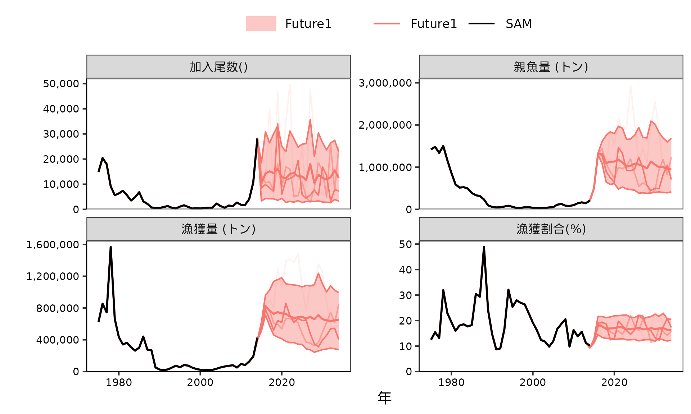
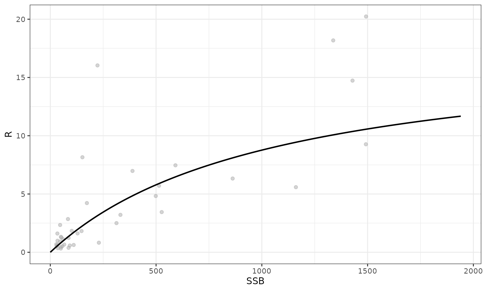
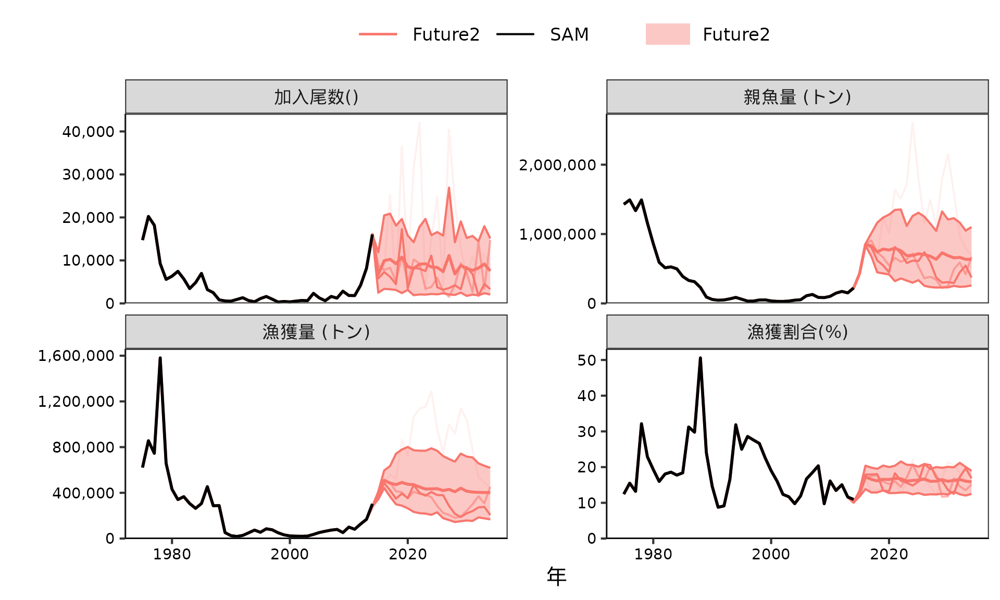
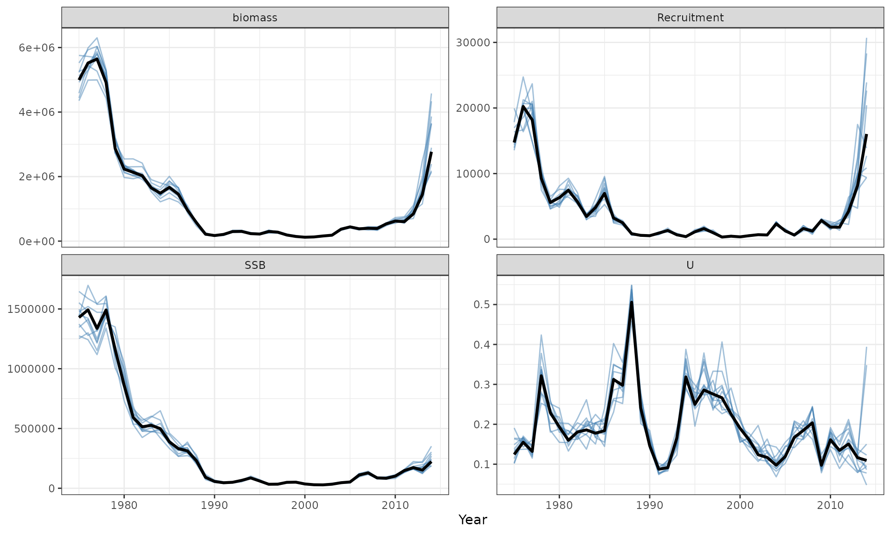
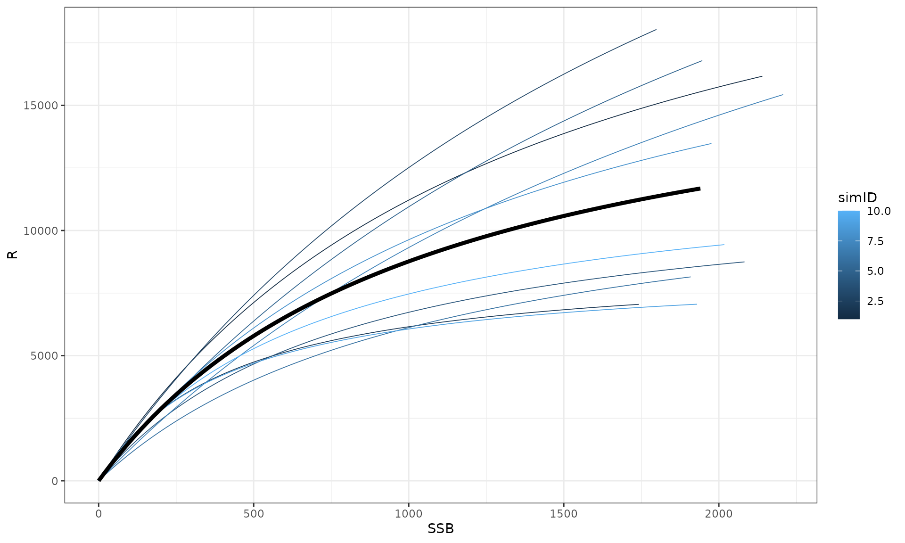
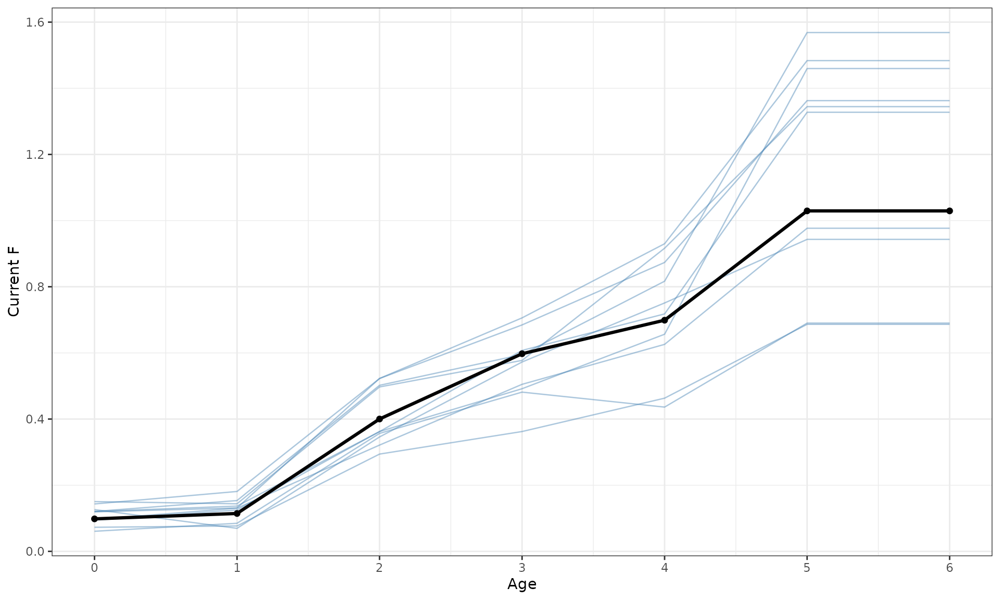
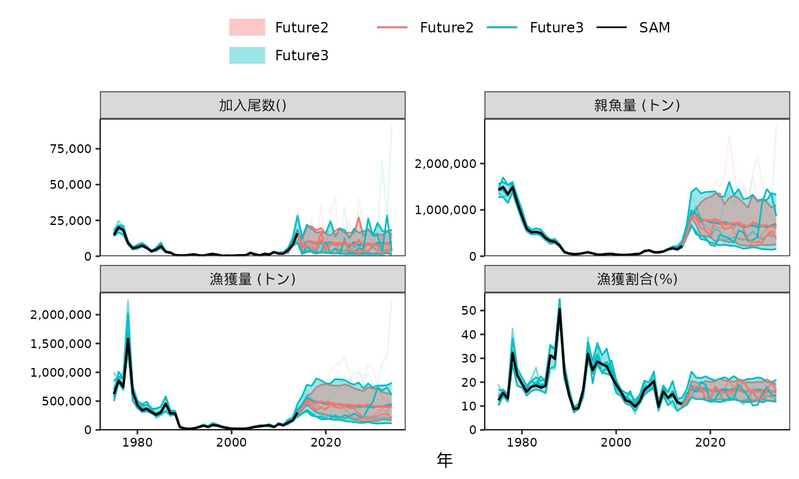
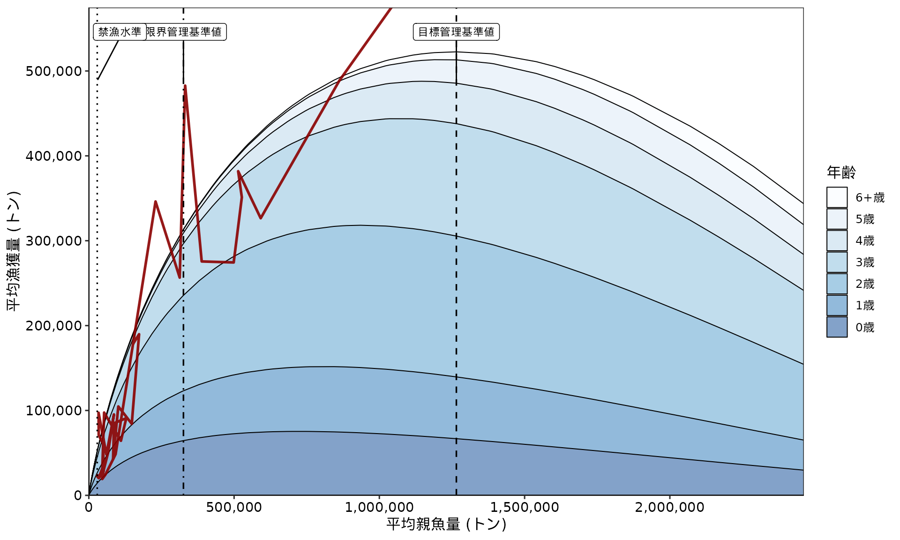
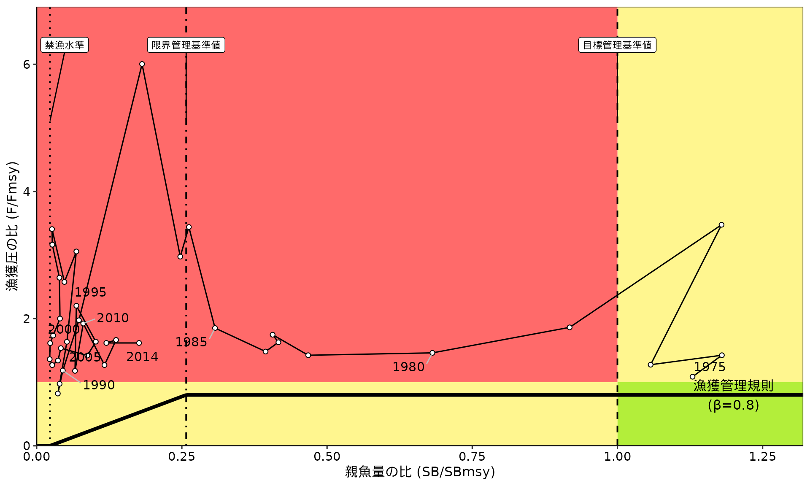
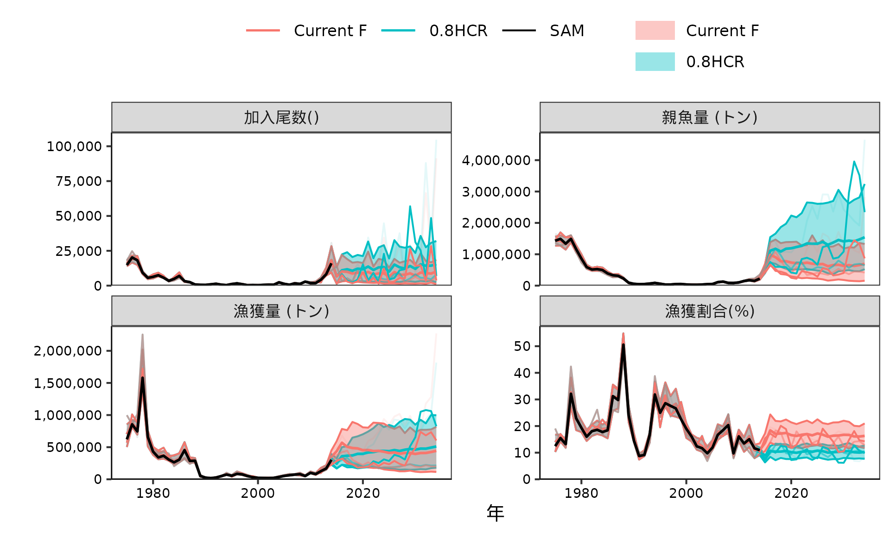

# SAMの結果から将来予測とMSY管理基準値計算をする方法

## 将来予測と管理基準値計算

`frasyr`と`frasam`を使って、SAMの結果から将来予測と管理基準値の計算をする方法を解説します
VPAとの違いは以下の3つです - 1歳魚以上の過程誤差を含める -
SAMで推定した再生産関係を使える - 資源量推定値の不確実性を考慮する

つまり、SAMを使うことにより、推定の不確実性や個体群動態の不確実性を組み込みやすくなります。
なお、このvignetteは`frasyr`の[future_vpaを使った将来予測とMSY管理基準値計算、簡易MSEの実行](https://ichimomo.github.io/frasyr/articles/future.html)を参考にして作っています。

### 1歳魚以上の過程誤差を含める

- まず、VPAのときと、同じように外から再生産関係を推定して、将来予測をする方法を説明します。
- ここでは、SAMでは加入にRandom
  walkを仮定し、あとでHockey-stick型の再生産関係を当てはめる場合を扱います（参考：[Shibata
  et
  al. 2021](https://esj-journals.onlinelibrary.wiley.com/doi/full/10.1002/1438-390X.12068)）
- なお、SAMではPopeの近似式を使っていないので、`Pope = FALSE`としてください

``` r


library(frasyr)
library(frasam)
library(tidyverse)

data(sam_ex) #SAM objectの読みこみ
sam_ex$SR #Random walk
#> [1] "RW"

# 再生産関係の当てはめ
SRdata <- get.SRdata(sam_ex)
resL2 = fit.SR(SRdata, SR = "HS", method = "L2", out.AR = FALSE, AR = 0)

sigmaN <- sam_ex$sigma.logN[-1] #0歳を除く過程誤差
# この例では小さいので、無視してもいいくらいだが

data_future_test1 <- make_future_data(
  sam_ex, # SAMの結果
  nsim = 100, # シミュレーション回数（実際はもっと増やしてください）
  nyear = 20, # 将来予測の年数
  future_initial_year_name = 2014, 
  start_F_year_name = 2014, 
  start_biopar_year_name=2015,
  start_random_rec_year_name = 2015,
  waa_year=2014, 
  waa=NULL, 
  waa_catch_year=2014, 
  waa_catch=NULL,
  maa_year=2014, 
  maa=NULL,
  M_year=2014, 
  M=NULL,
  faa_year=2011:2013, # currentF,   currentF=NULL,
  futureF=NULL, 
  # HCR setting (not work when using TMB)
  start_ABC_year_name=2015, # HCRを適用する最初の年(通常はVPA計算最後の年の２年後）
  HCR_beta=1, # HCRのbeta
  HCR_Blimit=-1, # HCRのBlimit
  HCR_Bban=-1, # HCRのBban
  HCR_year_lag=0, # HCRで何年遅れにするか
  # SR setting
  res_SR=resL2, # 将来予測に使いたい再生産関係の推定結果が入っているfit.SRの返り値
  seed_number=1, # シード番号
  resid_type="lognormal", 
  resample_year_range=0, # リサンプリングの場合、残差をリサンプリングする年の範囲
  bias_correction=FALSE, # バイアス補正をするかどうか,
  recruit_intercept=0, # 移入や放流などで一定の加入がある場合に足す加入尾数
  # Other
  Pope=FALSE, ## SAMの時はFALSE
  fix_recruit=NULL, 
  fix_wcatch=NULL,
  more_process_error = sigmaN  ## ここが大事manブラザーズ
  ) 
#>   allyear_label start  end
#> 1           VPA  1975 2014
#> 2        future  2015 2034
#> plus.group = TRUE 
#> Pope = FALSE

# 将来予測
res_future_test1 <- future_vpa(
  tmb_data = data_future_test1$data,
  optim_method = "none",                   
  multi_init = 1) # 将来予測のさい、将来のFに乗じる乗数(1=Fcurrent)

g1 <- plot_futures(
  vpares = sam_ex, 
  future.list = list("Future1" = res_future_test1), 
  what.plot = c("Recruitment","SSB","catch","U"),
  ncol = 2
  )

g1 <- plot_update2sam(g1) #labelをSAMに変更する

print(g1)
```



### SAMで推定された再生産関係を使う

- SAMで推定された再生産関係を使うこともできます
- `make_SRres`という関数を使って、`make_future_data`の引数`res_SR`に使うオブジェクトを使います
- SAM内の再生産関係は推定を安定化させるために、SSBもRもscaling
  (初期設定は1000で割る)して推定しているので、パラメータの単位が`fit.SR`で推定されたものと異なっています
- そのため、`make_future_data`の引数`scale_ssb`,
  `scale_number`を以下のように設定して、使ってください

``` r


use_sam_tmb()
#> [1] TRUE

# BHに変更
input <- sam_ex$input
input$SR <- "BH"
input$varN.fix <- c(NA,0.0001) #この例では1歳魚以上の過程誤差は固定しておく
sam_bh <- safe_call(sam, input)

# sigma.logNが固定されていることの確認
sam_bh$sigma.logN
#> [1] 0.6983394 0.0100000 0.0100000 0.0100000 0.0100000 0.0100000 0.0100000
summary(sam_bh$rep, "fixed") #logSdlogNはひとつだけ
#>                Estimate Std. Error
#> logQ         -5.3289981 0.18229848
#> logQ         -4.7300970 0.21874311
#> logQ         -5.5536309 0.08551861
#> logQ          0.3038523 0.06107457
#> logQ         -4.0057541 0.12202772
#> logSdLogFsta -0.4379183 0.15944641
#> logSdLogFsta -1.1649190 0.15605516
#> logSdLogN    -0.3590501 0.13702749
#> logSdLogObs  -0.5988730 0.10850681
#> logSdLogObs  -1.3124143 0.10996354
#> logSdLogObs  -0.7868360 0.10799883
#> logSdLogObs   0.1230147 0.11605390
#> logSdLogObs   0.3112469 0.11401112
#> logSdLogObs  -0.6851369 0.12586738
#> logSdLogObs  -1.0759369 0.11894707
#> logSdLogObs  -0.2896778 0.11527636
#> rec_loga     -4.0722955 0.16793140
#> rec_logb     -6.9657636 0.69853441
#> logit_rho     3.8553618 0.68077255
sam_bh$par_list$logSdLogN %>% exp
#> [1] 0.6983394 0.0100000

plot_SR_simple(sam_bh) #BH stock-recruit relationship
```



``` r


resBH <- make_SRres(sam_bh) #make_SRresを使ってmake_future_dataにいれる形式にする
sigmaN <- sam_bh$sigma.logN[-1] #0歳を除く過程誤差（この例では無視してもいいくらいだけども）

data_future_test2 <- make_future_data(
  sam_bh, # BHの時の結果
  nsim = 100, # シミュレーション回数（実際はもっと増やしてください）
  nyear = 20, # 将来予測の年数
  future_initial_year_name = 2014, 
  start_F_year_name = 2014, 
  start_biopar_year_name=2015,
  start_random_rec_year_name = 2015,
  waa_year=2014, 
  waa=NULL, 
  waa_catch_year=2014, 
  waa_catch=NULL,
  maa_year=2014, 
  maa=NULL,
  M_year=2014, 
  M=NULL,
  faa_year=2011:2013, # currentF,   currentF=NULL,
  futureF=NULL, 
  # HCR setting (not work when using TMB)
  start_ABC_year_name=2015, # HCRを適用する最初の年(通常はVPA計算最後の年の２年後）
  HCR_beta=1, # HCRのbeta
  HCR_Blimit=-1, # HCRのBlimit
  HCR_Bban=-1, # HCRのBban
  HCR_year_lag=0, # HCRで何年遅れにするか
  # SR setting
  seed_number=1, # シード番号
  resid_type="lognormal", 
  resample_year_range=0, # リサンプリングの場合、残差をリサンプリングする年の範囲
  bias_correction=FALSE, # バイアス補正をするかどうか,
  recruit_intercept=0, # 移入や放流などで一定の加入がある場合に足す加入尾数
  # Other
  Pope=FALSE, ## SAMの時はFALSE
  fix_recruit=NULL, 
  fix_wcatch=NULL,
  ## ここから下が大切！！！
  res_SR=resBH, # make_SRresのオブジェクト
  more_process_error = sigmaN,  
  scale_ssb=1/sam_bh$input$scale,
  scale_R=sam_bh$input$scale_number
  ) 
#>   allyear_label start  end
#> 1           VPA  1975 2014
#> 2        future  2015 2034
#> plus.group = TRUE 
#> Pope = FALSE

# 将来予測
res_future_test2 <- future_vpa(
  tmb_data = data_future_test2$data,
  optim_method = "none",                   
  multi_init = 1) # 将来予測のさい、将来のFに乗じる乗数(1=Fcurrent)

g2 <- plot_futures(
  vpares = sam_bh, 
  future.list = list("Future2" = res_future_test2), 
  what.plot = c("Recruitment","SSB","catch","U"),
  ncol = 2
  )

g2 <- plot_update2sam(g2) #labelをSAMに変更する

print(g2)
```



### 推定値の不確実性を考慮した将来予測

#### SAMの結果をシミュレートする

固定効果とランダム効果のJoint precision
matrixを使って、パラメータが推定値の周りに「正規分布でばらつく」と仮定して、パラメータの値をシミュレートする。その手順は以下のとおりである。
-　`sam`を`getJointPrecision=TRUE`にして再度解析する（既にやっていれば不要） -
Joint Precision
matrixとパラメータの値を取り出し、`rmvnorm_prec`関数でパラメータの値をシミュレート -
シミュレートされたパラメータで、`update_sam`関数でSAMの結果をアップデート -
結果を確認する

``` r


input <- sam_bh$input
input$getJointPrecision <- TRUE  # 
input$p0.list <- sam_bh$par_list #推定値を初期値に使う
input$bias.correct <- FALSE #Bias補正は無しにしておく

# シミュレートされた再生産関係の不確実性が大きすぎる場合には、a,bを固定することも考えられる
# input$map.add <- list("rec_loga" = factor(NA),"rec_logb" = factor(NA))

sam_bh_prec = safe_do_call(sam,input)

c(sam_bh$loglik, sam_bh_prec$loglik) #同じであればOK
#> [1] -476.0392 -476.0392

prec = sam_bh_prec$rep$jointPrecision  #精度行列
mu = sam_bh_prec$obj$env$last.par.best  #固定効果+ランダム効果のパラメータ推定値

nsim <- 10  #ここでは少な目
par_sim = frasam::rmvnorm_prec(mu,prec,n.sim=nsim,seed=2) #precision matrixから乱数を生成する関数

sam_bh_sim = lapply(1:nsim, function(i) frasam::update_sam(samres = sam_bh, new_par = par_sim[,i])) 

SRdata_sim <- purrr::map_dfr(
  sam_bh_sim, ~ make_SRres(.x)$pred,
    .id = "simID") |>
dplyr::mutate(simID = as.integer(simID))

what_plot_sim <- c("Recruitment", "SSB", "biomass", "U")

sam_bh_sim_dat <- purrr::map_dfr(
  sam_bh_sim,
  convert_sam_tibble,
  .id = "simID"
) |>
  dplyr::filter(stat %in% what_plot_sim) |>
  dplyr::mutate(simID = as.integer(simID))

sam_bh_dat <- convert_sam_tibble(sam_bh) |>
  dplyr::filter(stat %in% what_plot_sim)

ggplot() +
  geom_line(
    data = sam_bh_sim_dat,
    aes(x = year, y = value, group = simID),
    colour = "steelblue",
    linewidth = 0.5,
    alpha = 0.5
  ) +
  geom_line(
    data = sam_bh_dat,
    aes(x = year, y = value),
    colour = "black",
    linewidth = 1.1
  ) +
  facet_wrap(vars(stat), scales = "free_y", ncol = 2) +
  theme_bw() +
  labs(x = "Year", y = NULL)
```



``` r


# 再生産関係
SRdata_sim %>% ggplot(aes(x=SSB, y=R)) +
  geom_line(aes(group=simID, colour = simID), linewidth = 0.3) +
  geom_line(data = resBH$pred, colour = "black", linewidth = 1.5) +
  theme(legend.position = "none") +
  theme_bw()
```



#### シミュレートしたSAMを使って将来予測を行う

シミュレートしたSAM一つ一つに対して、`make_future_data`を適用し、`future_vpa`を適用するためのデータを作ります。 -
`make_future_data`の`nsim`には、SAMのシミュレーションラン1回から発生させる将来予測の回数を入れてください。つまり、nsim.sam
× nsim.futureが合計のシミュレーション回数になります。 -
`input`を作成する際に、`res_vpa`, `res_SR`,
`more_process_error`を更新することを忘れないでください -
`seed_number`も変えたほうがベター -
この場合は、Fcurrentの値もSAMのシミュレーションごとに違うことに注意

``` r


input_orig <- data_future_test2$input
input_orig$nsim <- 10 #SAMのsimulation run1回に対して何回将来予測するか。この値と、SAMのsimulation runの回数の積が将来予測のシミュレーション回数になる

base_seed <- 20260706

data_future_test3_list <- lapply(seq_along(sam_bh_sim), function(i) {
    x <- sam_bh_sim[[i]]

    input <- input_orig
    input$res_vpa <- x
    input$res_SR <- make_SRres(x)
    input$seed_number <- base_seed + i
    input$more_process_error <- x$sigma.logN[-1]

    # make_future_data() が表示する表だけを knit 結果から除外する
    invisible(capture.output(result <- do.call(make_future_data, input)))
    result
  })

data_future_test3 = unlist_future_data(data_future_test3_list) #unlist化してfuture_vpaに使える形にする

# Fcurrentのチェック
faa_current_sim <- sapply(data_future_test3_list, function(x) x$data$faa_mat[,"2015",1])
faa_current_est <- data_future_test2$data$faa_mat[,"2015",1]
age_current <- as.numeric(dimnames(data_future_test2$data$faa_mat)$age)

faa_current_sim_dat <- as.data.frame(faa_current_sim) |>
  rownames_to_column("Age") |>
  pivot_longer(
    cols = -Age,
    names_to = "simID",
    values_to = "F"
  ) |>
  mutate(
    Age = as.numeric(Age),
    simID = as.integer(gsub("\\D", "", simID))
  )

faa_current_est_dat <- data.frame(
  Age = age_current,
  F = as.numeric(faa_current_est)
)

ggplot() +
  geom_line(
    data = faa_current_sim_dat,
    aes(x = Age, y = F, group = simID),
    colour = "steelblue",
    linewidth = 0.45,
    alpha = 0.45
  ) +
  geom_line(
    data = faa_current_est_dat,
    aes(x = Age, y = F),
    colour = "black",
    linewidth = 1.1
  ) +
  geom_point(
    data = faa_current_est_dat,
    aes(x = Age, y = F),
    colour = "black",
    size = 1.6
  ) +
  scale_x_continuous(breaks = 0:6) +
  theme_bw() +
  labs(x = "Age", y = "Current F")
```



``` r


# 将来予測を実行
res_future_test3 <- future_vpa(
  tmb_data = data_future_test3$data,
  optim_method = "none",                   
  multi_init = 1) # 将来予測のさい、将来のFに乗じる乗数(1=Fcurrent)

g3 <- plot_futures(
  vpares = sam_bh, 
  future.list = list("Future2" = res_future_test2, 
                     "Future3" = res_future_test3), 
  what.plot = c("Recruitment","SSB","catch","U"),
  ncol = 2
  )

g3 <- plot_update2sam(g3, ncol_legend=3) #labelをSAMに変更する

print(g3)
```



資源量の推定値を考慮した方が将来予測の不確実性も大きいことが分かる

### MSY管理基準値の計算方法

同様のやり方で`make_future_data`と`unlist_future_data`を使ってインプット用のファイルを作成したうえで、MSY管理基準値やPGYを求めることができる。ここでは、`est_MSYRP`を使用する。

なお、Fmsy等を求める際にはcurrent
Fを何倍するかを最適化するが、シミュレーションごとにFmsyが変わると解釈が難しくなるので、ここではSAMの点推定値から求めたcurrent
F（の選択率）を使用して、Fmsyを求める `faa_year`, `currentF`,
`futureF`を以下のように設定する。

``` r


input_orig <- data_future_test2$input
input_orig$nsim <- 10 
input_orig$faa_year <- NULL
input_orig$currentF <- input_orig$futureF <- faa_current_est

base_seed <- 20260706

data_future_MSY_list <- lapply(seq_along(sam_bh_sim), function(i) {
    x <- sam_bh_sim[[i]]

    input <- input_orig
    input$res_vpa <- x
    input$res_SR <- make_SRres(x)
    input$seed_number <- base_seed + i
    input$more_process_error <- x$sigma.logN[-1]
    
    invisible(capture.output(result <- do.call(make_future_data, input)))
    result
  })

data_future_MSY = unlist_future_data(data_future_MSY_list) 

res_MSY <- est_MSYRP(data_future=data_future_MSY, 
                     optim_method="R", 
                     compile_tmb=FALSE, 
                     candidate_PGY=c(0.1,0.6),
                     only_lowerPGY="lower", 
                     candidate_B0=-1,
                     candidate_Babs=-1, 
                     calc_yieldcurve=TRUE,
                     select_Btarget=0, 
                     select_Blimit=0, 
                     select_Bban=0,
                     multi_upper_PGY=10)
#>         RP_name obj_value catch.mean  ssb.mean
#> 1 PGY_0.1_lower  52255.65   52254.57  28907.71
#> 2 PGY_0.6_lower 313533.90  313535.49 325663.48

# 要約表
knitr::kable(res_MSY$summary)
```

| RP_name | RP.definition | SSB | SSB2SSB0 | B | cB | U | Catch | Catch.CV | Fref/Fcur | Fref2Fcurrent | F0 | F1 | F2 | F3 | F4 | F5 | F6 | perSPR |
|:---|:---|---:|---:|---:|---:|---:|---:|---:|---:|---:|---:|---:|---:|---:|---:|---:|---:|---:|
| MSY | Btarget0 | 1265097.92 | 0.3597909 | 4473753.1 | 4473753.1 | 0.1168049 | 522556.50 | 0.8515086 | 0.6588833 | 0.6588833 | 0.0647628 | 0.0754406 | 0.2636583 | 0.3936812 | 0.4604475 | 0.6782154 | 0.6782154 | 0.5522816 |
| B0 | NA | 3516202.89 | 1.0000000 | 8714299.4 | 8714299.4 | 0.0000000 | 0.00 | NaN | 0.0000000 | 0.0000000 | 0.0000000 | 0.0000000 | 0.0000000 | 0.0000000 | 0.0000000 | 0.0000000 | 0.0000000 | 1.0000000 |
| PGY_0.1_lower | Bban0 | 28907.71 | 0.0082213 | 191153.4 | 191153.4 | 0.2733646 | 52254.57 | 1.6179202 | 2.6369642 | 2.6369642 | 0.2591918 | 0.3019264 | 1.0552059 | 1.5755800 | 1.8427902 | 2.7143349 | 2.7143349 | 0.2076993 |
| PGY_0.6_lower | Blimit0 | 325663.48 | 0.0926179 | 1609912.7 | 1609912.7 | 0.1947531 | 313535.49 | 1.1779419 | 1.4847569 | 1.4847569 | 0.1459393 | 0.1700013 | 0.5941394 | 0.8871388 | 1.0375929 | 1.5283209 | 1.5283209 | 0.3418851 |

``` r


# Yield curve
trace_plot <- res_MSY$trace
refs.plot <- dplyr::filter(
  res_MSY$summary,
  RP.definition %in% c("Btarget0","Blimit0","Bban0")) %>%
  arrange(desc(SSB))

label_name_kobe <- c("目標管理基準値","限界管理基準値","禁漁水準")

yield_curve_simple <- plot_yield(trace_plot,
                                 refs.plot,
                                 refs.label = label_name_kobe,
                                 future = NULL,
                                 past = sam_bh,
                                 past_year_range = 1975:2013,
                                 labeling = FALSE,
                                 refs.color = rep("black",3),
                                 biomass.unit = 1,
                                 AR_select = FALSE,
                                 xlim.scale = 0.7,
                                 ylim.scale = 1.1,
                                 plus_group = TRUE) + 
  theme_SH(legend.position="right") + 
  scale_x_continuous(labels = scales::comma)+ 
  scale_y_continuous(labels = scales::comma)

print(yield_curve_simple)
```



``` r


## Kobe plot
Btarget0 <- derive_RP_value(res_MSY$summary,"Btarget0")$SSB
Blimit0  <- derive_RP_value(res_MSY$summary,"Blimit0")$SSB
Bban0    <- derive_RP_value(res_MSY$summary,"Bban0")$SSB
SPR_MSY0 <- derive_RP_value(res_MSY$summary,"Btarget0")$perSPR
Fmsy0 <- res_MSY$Fvector %>%
    slice(which(res_MSY$summary$RP.definition=="Btarget0")) %>%
    as.numeric()
refs <- tibble(Bmsy  = Btarget0, Blimit= Blimit0, Bban  = Bban0)

SPR.history <- get.SPR(sam_bh,
                       target.SPR = SPR_MSY0*100,Fmax=8)$ysdata
kobe.ratio <- tibble(year   = as.numeric(colnames(sam_bh$ssb)),
                     Fratio = SPR.history$"F/Ftarget",
                     Uratio = get_U(sam_bh)/derive_RP_value(res_MSY$summary,"Btarget0")$U,
                     Bratio = get_ssb(sam_bh)/Btarget0,
                      DBratio = NA) %>%
     dplyr::filter(!is.na(Bratio))
kobe_plot <- plot_kobe_gg(FBdata = kobe.ratio,
                          refs_base = res_MSY$summary,
                          roll_mean = 1,
                          Btarget = "Btarget0",
                          beta = 0.8,
                          refs.color = rep("black",3),
                          yscale = 1.2,
                          HCR.label.position = c(1,1),
                          RP.label = label_name_kobe,
                          Fratio = kobe.ratio$Fratio,
                          plot.year = "all")

print(kobe_plot)
```



#### HCRに基づく将来予測

最後に、MSY計算に基づく、Fmsy,, Blimit, Bbanを基にした将来予測を実行する
`make_future_data`の`futureF`, `HCR_beta`, `HCR_Blimit`,
`HCR_Bban`を以下のように設定する

``` r

input_orig <- data_future_test2$input
input_orig$nsim <- 10
input_orig$faa_year <- NULL
input_orig$currentF <- faa_current_est
# ここからHCRの設定
input_orig$futureF <- Fmsy0
input_orig$HCR_beta <- 0.8
input_orig$HCR_Blimit <- Blimit0
input_orig$HCR_Bban <- Bban0             

base_seed <- 20260706

data_future_HCR_list <- lapply(seq_along(sam_bh_sim), function(i) {
    x <- sam_bh_sim[[i]]

    input <- input_orig
    input$res_vpa <- x
    input$res_SR <- make_SRres(x)
    input$seed_number <- base_seed + i
    input$more_process_error <- x$sigma.logN[-1]

    # make_future_data() が表示する表だけを knit 結果から除外する
    invisible(capture.output(result <- do.call(make_future_data, input)))
    result
  })

data_future_HCR = unlist_future_data(data_future_HCR_list) 

# 将来予測を実行
res_future_HCR <- future_vpa(
  tmb_data = data_future_HCR$data,
  optim_method = "none",                   
  multi_init=1,
  multi_lower=1,
  multi_upper=1,
  SPRtarget=derive_RP_value(res_MSY$summary,"Btarget0")$perSPR*100,
  ) 

g4 <- plot_futures(
  vpares = sam_bh, 
  future.list = list("Current F" = res_future_test3, 
                     "0.8HCR" = res_future_HCR), 
  what.plot = c("Recruitment","SSB","catch","U"),
  ncol = 2
  )

g4 <- plot_update2sam(g4,ncol_legend = 3) #labelをSAMに変更する

print(g4)
```



### 注意事項

#### 残差リサンプリングについて

*対数正規分布の誤差を基本としてください (`resid_type="lognormal"`)*

プログラミング的には他のオプションも可能だと思いますが、SAMでは、Nがランダム効果（確率分布）として推定されており、再生産関係もその条件で推定されています。ランダム効果として推定された値から求めた残差は確率分布を無視しており、SAMで推定された加入変動
(sigmaR)
の値との整合性がありません。そのため、残差リサンプリングをすると、おそらく統計的には間違ったことをしていると思います。

バックワードリンサンプリングなどを行いたい場合は、事後的に推定した再生産関係を使ってください。それなら、OKな気がします。そのときは、SAMでは`SR="RW"`のようにSSBに依存しない再生産関係を使う方がよいでしょう。

#### Popeオプション

SAMではBaranovの漁獲方程式を用いているので、*必ず`Pope="TRUE"`としてください*

#### スケールオプション

- SAMでは、親魚量と加入量のオーダーを変えて再生産関係を推定しているので、`make_future_data`で`scale_ssb`と`scale_number`を設定するのを忘れないようにしてください
- `sam`で`scale=1`（SSBを割る値）,
  `scale_number=1`（Rを割る値）にして解析することもできます
- VPAや`SR="RW"`の結果に対して、`fit.SR`を当てはめた結果をSAMの初期値`a.init`,
  `b.init`に与えて、`scale=1`（SSBを割る値）,
  `scale_number=1`（Rを割る値）として解析することもできます。

#### 推定値の不確実性を考慮した将来予測およびMSY管理基準値計算

- `make_future_data`の`nsim`には、SAMのシミュレーションラン1回から発生させる将来予測の回数を入れてください
- `input`を作成する際に、*`res_vpa`, `res_SR`,
  `more_process_error`の更新および`seed_number`の変更を忘れないように気を付けてください*
- Fmsy等を求める際には、SAMの点推定値から求めたcurrent
  F（の選択率）を使用するのが良いと思われる（*`faa_year`, `currentF`,
  `futureF`の設定を忘れないように*）。
- HCRの下で将来予測をする際には、*`make_future_data`の`futureF`,
  `HCR_beta`, `HCR_Blimit`, `HCR_Bban`の設定に気を付けてください*
