# SAMを使った資源量推定

## SAMのインストール

- インストールに必要なパッケージ(devtools)はあらかじめインストールしておいてください

``` r


## インストール (最新ブランチはcmsa11→vignetteとかが追加されたcreate_vignette)
#devtools::install_github("ShotaNishijima/frasam@create_vignette") # frasam
## frasyrも使うのでfrasyrもインストールしてください
#devtools::install_github("ichimomo/frasyr@dev")

# ライブラリの呼び出し
library(frasyr)
library(frasam)
# devtools::load_all()
library(tidyverse)
library(patchwork)
# install.packages("lemon")
library(lemon)
```

## SAMを適用するデータセットの作成

VPAを適用するときのデータセットと同じ形式のデータセットが利用できます。
ただし、VPAでは資源量指数が利用できなくても適用できますが、SAMでは資源量指数の利用が必須になります。

### データの読み込み

``` r


caa   <- read.csv("https://raw.githubusercontent.com/ichimomo/frasyr/dev/data-raw/ex1_caa.csv",  row.names=1)
waa   <- read.csv("https://raw.githubusercontent.com/ichimomo/frasyr/dev/data-raw/ex1_waa.csv",  row.names=1)
maa   <- read.csv("https://raw.githubusercontent.com/ichimomo/frasyr/dev/data-raw/ex1_maa.csv",  row.names=1)
index <- read.csv("https://raw.githubusercontent.com/ichimomo/frasyr/dev/data-raw/ex1_index.csv",  row.names=1)
# create pseudo data for caa
set.seed(1)
caa   <- caa * exp(rnorm(length(caa), mean=-0.5 * (0.1)^2, sd=0.1))

# Indexがひとつだと例としてあまり適切でないので、適当な加入Indexを作成する
rec_idx <- seq(1,0.25,length=10)*exp(rnorm(10,0,0.2))
index[2,] <- rec_idx

dat <- data.handler(caa=caa, waa=waa, maa=maa, M=0.5, index=index)
```

## SAMの解析

### 基本的な設定で解析と結果の出力

``` r

# まずはsamのhelpファイルを閲覧してどんなオプションがあるか把握しましょう
#help(sam)

# SAMを使う準備 (samのオプションtmb.run=TRUEでも良いかもだけど、今はうまく動かないみたい？)
use_sam_tmb(TmbFile="sam2",overwrite=FALSE) #compile and activate
#> [1] TRUE

# samの実施
# (*)の部分が設定ポイント
res_sam <- sam(dat,
               last.catch.zero = FALSE,
               cpp.file.name = "sam2",
               tmb.run = FALSE, # TRUEにするとtmbをコンパイルしてロードする。最初の１回だけTRUEにするのが良い？sam2だと動かない
               rec.age = 0,
               plus.group = TRUE,
               alpha = 1, # 最高年齢と最高年齢-1歳のFが同じと仮定（VPAと同じ仮定)
               # est.method = "ml",
               # 資源量指数に関わる設定。資源量指数の数だけベクトルで与える。
               abund = c("SSB", "N"),
               min.age = c(0, 0),
               max.age = c(6, 0),
               b.est = FALSE, # b推定の有無(*)
               b.fix = NA,
               # 分散に関わる設定。どの分散を同じとするか。年齢の数だけ与える (*)
               varC =  c(0,0,0,0,0,0,0),　#とりあえずすべての年齢で共通
               varN = c(0,1,1,1,1,1,1),　#0歳と1歳魚以上で分ける
               varF = c(0,0,0,0,0,0,0),   #とりあえずすべての年齢で共通
               # 1歳魚以上のlog(N)のプロセス誤差を小さい値で固定(分散の値なので、この場合SD=0.01に相当)
               varN.fix = c(NA, 1e-4),
               # 再生産関係推定に関わる設定 (*)
               SR = "BH",
               AR = 0,
               # Fの多変量Random walkの非対角成分の相関係数のタイプ。１ならすべての年齢間で相関係数1, 0なら完全にランダム, 2は任意の年齢間で共通のrhoを推定、3は年齢i,jの相関を\eqn{\rho^|i-j|}で推定 (*)
               rho.mode = 0,
               # 初期値の設定
               q.init = NULL,
               sdFsta.init = NULL,
               sdLogN.init = c(0.2, 0.2),
               sdLogObs.init = NULL,
               rho.init = NULL,
               a.init = NULL,
               b.init = NULL,
               # その他
               # ref.year = 1:5, # 重要そうだけど使われていない
               bias.correct = TRUE,
               bias.correct.sd = FALSE,
               get.random.vcov = FALSE,
               silent = TRUE,
               remove.Fprocess.year = NULL,
               RW.Forder = 0,
               map = NULL, # map (パラメータの推定の有無を個別に調整する) を入れる
               map.add = NULL, # mapを追加する
               p0.list = NULL,
               scale = 1000,
               scale_number = 1000,
               gamma = 10,
               sel.def = "max",
               use.index = NULL,
               upper = NULL,
               lower = NULL,
               index.key = NULL,
               index.b.key = NULL,
               lambda = 0,
               add_random = NULL,
               tmbdata = NULL,
               sep_omicron = TRUE,
               catch_prop = NULL,
               no_est = FALSE,
               getJointPrecision = FALSE,
               loopnum = 2
)

## 推定結果の確認: opt=推定パラメータや目的関数、収束の有無
## - $convergenceが0なら収束
res_sam$opt
#> $par
#>         logQ         logQ logSdLogFsta    logSdLogN  logSdLogObs  logSdLogObs 
#>     9.560474    -7.232697    -1.877590    -1.761564    -3.101510    -1.367962 
#>  logSdLogObs     rec_loga     rec_logb 
#>    -1.082575     2.365818   -20.894580 
#> 
#> $objective
#> [1] -4.304594
#> 
#> $convergence
#> [1] 0
#> 
#> $iterations
#> [1] 86
#> 
#> $evaluations
#> function gradient 
#>      115       87 
#> 
#> $message
#> [1] "relative convergence (4)"

## 推定結果の確認: rep=推定パラメータとSE
## - 推定値(Estimate)に対してStd.Errorが異常に大きくないか
## - Maximum gradient componentが十分小さい値か（1e-3以下なら十分OK、多数のパラメータを推定する難しいモデルなら上限0.1以下くらいでも？)
res_sam$rep
#> sdreport(.) result
#>                Estimate   Std. Error
#> logQ           9.560474 8.811784e-02
#> logQ          -7.232697 1.118901e-01
#> logSdLogFsta  -1.877590 1.476098e-01
#> logSdLogN     -1.761564 2.699046e-01
#> logSdLogObs   -3.101510 7.512004e-01
#> logSdLogObs   -1.367962 2.342731e-01
#> logSdLogObs   -1.082575 2.288350e-01
#> rec_loga       2.365818 6.530280e-02
#> rec_logb     -20.894580 4.572071e+04
#> Maximum gradient component: 1.263547e-05

## 推定結果の確認: AIC（単独ではあまり意味がない。モデルを比較するときに）
res_sam$aic
#> [1] 9.390811

## 推定結果の確認: 分散パラメータのsigma。ノーマルスケールで、大きさを確認。
## - すごく小さい値で推定されている場合には推定の意味がないので推定しないなどする
## - どのsigmaを共通にするか？を決める
res_sam[c("sigma","sigma.logC","sigma.logFsta","sigma.logN")]
#> $sigma
#> [1] 0.2546253 0.3387221
#> 
#> $sigma.logC
#> [1] 0.04498121 0.04498121 0.04498121 0.04498121 0.04498121 0.04498121 0.04498121
#> 
#> $sigma.logFsta
#> [1] 0.1529583 0.1529583 0.1529583 0.1529583 0.1529583 0.1529583 0.1529583
#> 
#> $sigma.logN
#> [1] 0.171776 0.010000 0.010000 0.010000 0.010000 0.010000 0.010000

## 固定効果の確認・出力
fixef = out_par(res_sam,filename="FEpar")
knitr::kable(fixef)
```

| FE           |        MLE |           SE |  Gradient | Unlinked value |
|:-------------|-----------:|-------------:|----------:|---------------:|
| logQ         |   9.560474 | 8.811780e-02 |  1.26e-05 |   1.419257e+04 |
| logQ         |  -7.232697 | 1.118901e-01 |  4.80e-06 |   7.226000e-04 |
| logSdLogFsta |  -1.877590 | 1.476098e-01 |  4.50e-06 |   1.529583e-01 |
| logSdLogN    |  -1.761564 | 2.699046e-01 | -3.00e-07 |   1.717760e-01 |
| logSdLogObs  |  -3.101510 | 7.512004e-01 | -6.00e-07 |   4.498120e-02 |
| logSdLogObs  |  -1.367962 | 2.342731e-01 | -4.40e-06 |   2.546253e-01 |
| logSdLogObs  |  -1.082575 | 2.288350e-01 | -5.00e-07 |   3.387221e-01 |
| rec_loga     |   2.365818 | 6.530280e-02 | -4.10e-06 |   1.065275e+01 |
| rec_logb     | -20.894580 | 4.572071e+04 |  0.00e+00 |   0.000000e+00 |

``` r


## 結果のプロット
# デルタ法にかかる信頼区間が描かれる
plot_samvpa(res_sam, CI=0.95)
```


``` r


## 結果の出力
out_sam(res_sam, filename="sam")
```

### VPAや、異なる設定のSAMとの比較

``` r

## VPAもやってみる
res_vpa <- vpa(dat,fc.year=1998:2000,tf.year = 1998:1999,
               term.F="max",stat.tf="mean",Pope=TRUE,tune=TRUE,p.init=0.5, abund=c("SSB","N"), min.age=c(0,0), max.age=c(6,0), sel.update=TRUE)

## VPAとSAMのモデルの比較
gg_graph1 <- plot_vpa(list(VPA=res_vpa, SAM=res_sam))
gg_graph2 <- plot_vpa(list(VPA=res_vpa, SAM=res_sam), what.plot=c("fishing_mortality"))

print(gg_graph1)
```

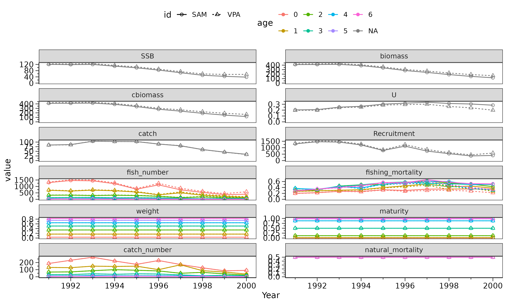

``` r

print(gg_graph2)
```

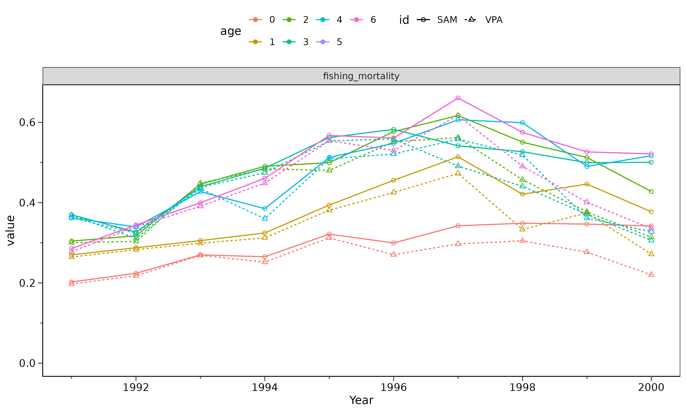

``` r


## 設定を少し変えてもう一度実行する場合
sam_input <- res_sam$input # samに渡した引数のリスト
sam_input$rho.mode <- 1 # 引数の一部を変える（たとえば、Fの相関を1にする→今は選択率一定)
res_sam2 <- do.call(sam, sam_input) # do.callで再度計算
res_sam2$opt #収束している
#> $par
#>         logQ         logQ logSdLogFsta    logSdLogN  logSdLogObs  logSdLogObs 
#>     9.512569    -7.296031    -2.061696    -1.834227    -2.377935    -1.437568 
#>  logSdLogObs     rec_loga     rec_logb 
#>    -1.110560     2.382367   -19.310621 
#> 
#> $objective
#> [1] -19.7347
#> 
#> $convergence
#> [1] 0
#> 
#> $iterations
#> [1] 77
#> 
#> $evaluations
#> function gradient 
#>      102       78 
#> 
#> $message
#> [1] "relative convergence (4)"
res_sam2$rep #sdreportの結果
#> sdreport(.) result
#>                Estimate   Std. Error
#> logQ           9.512569 9.125235e-02
#> logQ          -7.296031 1.177386e-01
#> logSdLogFsta  -2.061696 2.787175e-01
#> logSdLogN     -1.834227 2.616238e-01
#> logSdLogObs   -2.377935 1.120733e-01
#> logSdLogObs   -1.437568 2.347149e-01
#> logSdLogObs   -1.110560 2.293442e-01
#> rec_loga       2.382367 5.989811e-02
#> rec_logb     -19.310621 2.604642e+04
#> Maximum gradient component: 1.344941e-05
res_sam2$rep$pdHess #Hessianが正定値を持つかどうか（持たない場合SEが計算できない）
#> [1] TRUE

## 2つのモデルのAICの比較
## - 選択率一定モデルのほうがAICが小さい（＝より予測力が高い）
c(res_sam$aic, res_sam2$aic)
#> [1]   9.390811 -21.469394

c(res_sam$rho, res_sam2$rho) #Fの相関係数
#> [1] 0 1

sam_input$SR <- "RW" #加入をRWに変更
res_sam3 <- do.call(sam,sam_input)
res_sam3$opt　
#> $par
#>         logQ         logQ logSdLogFsta    logSdLogN  logSdLogObs  logSdLogObs 
#>     9.505218    -7.303392    -2.047747    -1.254582    -2.374557    -1.444440 
#>  logSdLogObs 
#>    -1.108994 
#> 
#> $objective
#> [1] -14.68522
#> 
#> $convergence
#> [1] 0
#> 
#> $iterations
#> [1] 67
#> 
#> $evaluations
#> function gradient 
#>      107       67 
#> 
#> $message
#> [1] "relative convergence (4)"
res_sam3$rep
#> sdreport(.) result
#>               Estimate Std. Error
#> logQ          9.505218 0.09135789
#> logQ         -7.303392 0.11811372
#> logSdLogFsta -2.047747 0.28031272
#> logSdLogN    -1.254582 0.25257639
#> logSdLogObs  -2.374557 0.11286860
#> logSdLogObs  -1.444440 0.23289469
#> logSdLogObs  -1.108994 0.22963117
#> Maximum gradient component: 0.0001434224
res_sam3$rep$pdHess
#> [1] TRUE

c(res_sam$aic, res_sam2$aic, res_sam3$aic)
#> [1]   9.390811 -21.469394 -15.370439


## SAMだけの比較 (fishing_mortalityはFの平均？)
## - 信頼区間付きバージョン
## - VPAの結果も並列で示せるが、その場合vpa関数の実行にはTMB=TRUEオプションをつける必要あり
plot_samvpa(list(SAM=res_sam, SAM2=res_sam2,SAM3=res_sam3),
            what.plot = c("biomass","SSB","Recruitment","U","catch","fishing_mortality"))
```

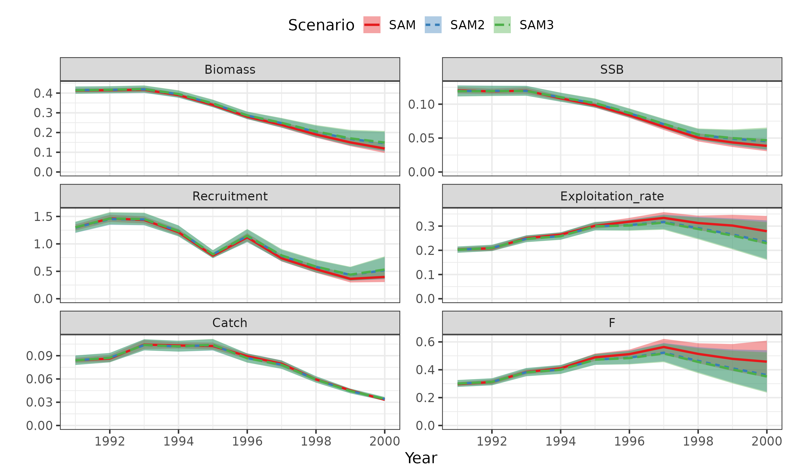

``` r


## F at age by year (境さんコード、関数化必要？時系列が長い場合への対応が必要)
res_samdata <- make_assess_result(res_sam)　# 境さん関数(make_assess_result)

(gg <- res_samdata %>% dplyr::filter(stat=="faa") %>%
    ggplot() +
    geom_ribbon(aes(x=Age, ymax=upper, ymin=lower, group=Model, fill=Model), alpha=0.5) +
    geom_line(aes(x=Age, y=Value, colour=Model, group=Model, size=Model), linetype=1) +
    facet_wrap(.~Year, scales = "free_y", nrow=10, ncol=2, dir="v") +
    scale_y_continuous(limits = c(0, NA)) +
    scale_fill_manual("Model", values = c("#F8766D", "black")) +
    scale_colour_manual("Model", values = c("#F8766D", "black")) +
    scale_size_manual("Model", values = c(1, 0.5), guide = "none") +
    theme_bw() + 
    # labs(title="FAA", x=xlab, y=ylab) +
    theme(axis.text.x = element_text(size = 11, color = "black"),
          axis.text.y = element_text(size = 11, color = "black"),
          axis.line.x = element_line(linewidth = 0.3528), axis.line.y = element_line(linewidth = 0.3528),
          axis.minor.ticks.length = rel(0.5)))
```

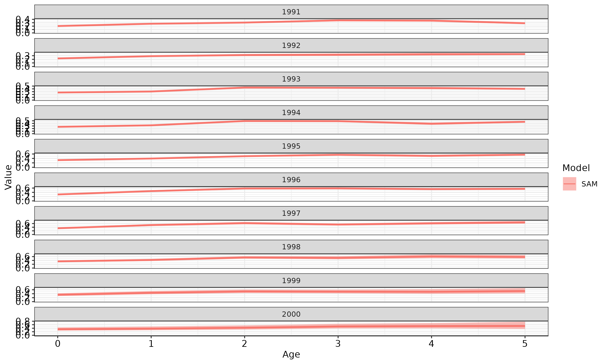

``` r


## F at age by year
(gg <- res_samdata %>% dplyr::filter(stat=="faa") %>%
    mutate(Age=factor(Age)) %>%
    ggplot() +
    geom_ribbon(aes(x=Year, ymax=upper, ymin=lower, group=Model, fill=Model), alpha=0.5) +
    geom_line(aes(x=Year, y=Value, colour=Model, group=Model), linetype=1) +
    facet_wrap(.~Age, scales = "free_y", nrow=10, ncol=2, dir="v") +
    scale_y_continuous(limits = c(0, NA)) +
    #  scale_fill_manual("Model", values = c("#F8766D", "black")) +
    #  scale_colour_manual("Model", values = c("#F8766D", "black")) +
    #  scale_size_manual("Model", values = c(1, 0.5), guide = "none") +
    theme_bw() + 
    # labs(title="FAA", x=xlab, y=ylab) +
    theme(axis.text.x = element_text(size = 11, color = "black"),
          axis.text.y = element_text(size = 11, color = "black"),
          axis.line.x = element_line(linewidth = 0.3528), axis.line.y = element_line(linewidth = 0.3528),
          axis.minor.ticks.length = rel(0.5)))
```

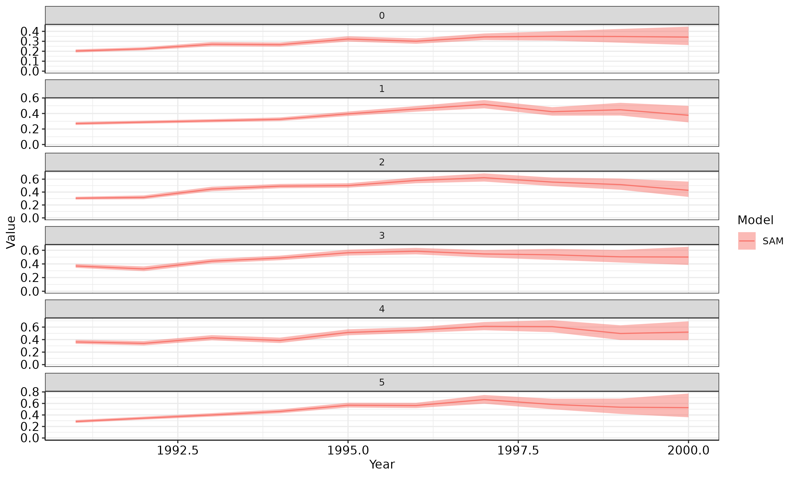

## モデル選択

- rho.mode 0, 1, 2, 3のどれか？
- 再生産関係の関数と自己相関
- どの要素でsigmaを推定値し、どの年齢間でsigmaを共通にするか?
  - いろいろ試してAICの小さいものを選ぶ。（最新のcAICというものもあるようだが、未実装）

``` r

## varF(Fのプロセス誤差)とvarC（CAAの観測誤差）をどの年齢間で分けるかをstepAICで検討する

# いまは1歳魚以上のvarNを固定しているが、それも検討することも可能
# 検討する変数(VarF, VarC)を境界を入れる年齢Xについてのデータを生成(varとXを列名に使用)
# ここでは収束しやすさからRWの場合を使用する（BHを使うとlog(b)->-InfになりSEが発散する
grid = expand.grid(var=c("varF","varC"),X=1:6) %>%
  filter(!(var == "varF" & X == 6)) #5-6歳のFは同じと仮定しており6歳は不要なので除いておく

res_select <- select_sigma_grid(
  res_sam3, grid=grid, check_converge = TRUE, SEmax=Inf) # 

# stage 0 が元のモデル
# varがどの分散を分けたか
# whichはどの年齢で分けたか（1なら0歳と1歳魚以上で分ける）
# AIC最少の分け方をして、AICが下がらなくなるまで実行
# selectedはステージ内でAIC最少、bestは検討したすべてのモデルでAIC最少
res_select$tbl_sigma %>% knitr::kable()
```

| stage |       AIC | convergence | pdHess |     maxSE | var  | which | model    |
|------:|----------:|------------:|:-------|----------:|:-----|------:|:---------|
|     0 | -15.37044 |           0 | TRUE   | 0.2803127 | NA   |    NA | selected |
|     1 | -16.17782 |           1 | TRUE   | 0.3474763 | varF |     1 | NA       |
|     1 |  69.82258 |           1 | FALSE  | 1.9491407 | varC |     1 | NA       |
|     1 | -15.20191 |           1 | TRUE   | 0.2912071 | varF |     2 | NA       |
|     1 | -13.64304 |           0 | TRUE   | 0.2808003 | varC |     2 | NA       |
|     1 | -13.38721 |           1 | TRUE   | 0.2887168 | varF |     3 | NA       |
|     1 | -13.37596 |           1 | TRUE   | 0.2804332 | varC |     3 | NA       |
|     1 | -14.33871 |           1 | TRUE   | 0.2840469 | varF |     4 | NA       |
|     1 | -13.40533 |           0 | TRUE   | 0.2806028 | varC |     4 | NA       |
|     1 | -15.81438 |           0 | TRUE   | 0.2899745 | varF |     5 | best     |
|     1 | -13.66380 |           1 | TRUE   | 0.2789652 | varC |     5 | NA       |
|     1 | -13.78186 |           0 | TRUE   | 0.4950589 | varC |     6 | NA       |
|     2 |  68.53783 |           1 | FALSE  | 0.4329785 | varC |     1 | NA       |
|     2 | -14.57080 |           1 | TRUE   | 0.3492846 | varF |     2 | NA       |
|     2 | -15.13593 |           0 | TRUE   | 0.3180332 | varC |     2 | NA       |
|     2 | -14.64335 |           1 | TRUE   | 0.3529421 | varF |     3 | NA       |
|     2 | -14.25631 |           1 | TRUE   | 0.3319147 | varC |     3 | NA       |
|     2 | -14.26322 |           1 | TRUE   | 0.3443232 | varF |     4 | NA       |
|     2 | -14.25064 |           0 | TRUE   | 0.3373992 | varC |     4 | NA       |
|     2 | -15.45370 |           0 | TRUE   | 0.3410812 | varF |     5 | selected |
|     2 | -14.71694 |           0 | TRUE   | 0.3486078 | varC |     5 | NA       |
|     2 | -15.15816 |           0 | TRUE   | 0.6002071 | varC |     6 | NA       |

``` r


## Best modelの結果チェック
# FAAの誤差が0歳と1歳以上で分かれる
res_best <- res_select$bestres #AIC最少をベストモデルとする
cbind(
  "Age" = 0:6,
  "SD_caa" = res_best$sigma.logC,
  "SD_faa" = res_best$sigma.logF,
  "SD_naa" = res_best$sigma.logN
) %>% knitr::kable()
```

| Age |    SD_caa |    SD_faa |    SD_naa |
|----:|----------:|----------:|----------:|
|   0 | 0.0898453 | 0.0988362 | 0.2748446 |
|   1 | 0.0898453 | 0.1475809 | 0.0100000 |
|   2 | 0.0898453 | 0.1475809 | 0.0100000 |
|   3 | 0.0898453 | 0.1475809 | 0.0100000 |
|   4 | 0.0898453 | 0.1475809 | 0.0100000 |
|   5 | 0.0898453 | 0.1475809 | 0.0100000 |
|   6 | 0.0898453 | 0.1475809 | 0.0100000 |

## 再生産関係のプロット

``` r


## 単純なプロット
plot_SR_simple(res_sam2) #BHモデルを例に
```

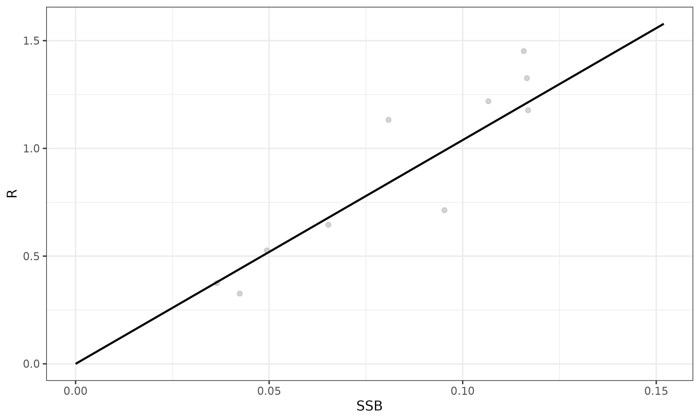

``` r


## SAMの結果からfraysrで使える再生産関係のオブジェクトを作成するとfrasyrの関数が使える
SR_sam0 <- res_sam2 %>% make_SRres
biopar <- derive_biopar(res_sam2, derive_year=1998:2000)
## steepness, R0, B0, 決定論的なMSY管理基準値の計算
steepness_sam <- calc_steepness(SR="BH", rec_pars=SR_sam0$pars,M=biopar$M, waa=biopar$waa, maa=biopar$maa, faa=biopar$faa)
## 再生産関係に依存しない管理基準値の計算(frasyr::ref.F)
# FcurrentとPope=FALSEを明示的に引数に含める必要がある
Fcurrent <- rowMeans(res_sam2$faa[,as.character(1998:2000)])
refF_res <- ref.F(res_sam2,Fcurrent=Fcurrent,Pope=FALSE)
```


``` r

refF_res$summary
#>            Fcurrent Fmed Flow Fhigh      Fmax      F0.1 Fmean FpSPR.10.SPR
#> max       0.4565963   NA   NA    NA 0.5620096 0.3383565    NA    0.6752882
#> mean      0.4121443  NaN  NaN   NaN 0.5072950 0.3054157   NaN    0.6095454
#> Fref/Fcur 1.0000000   NA   NA    NA 1.2308676 0.7410408    NA    1.4789611
#>           FpSPR.20.SPR FpSPR.30.SPR FpSPR.40.SPR FpSPR.50.SPR FpSPR.60.SPR
#> max          0.4380875    0.3135295    0.2310909    0.1704472    0.1229955
#> mean         0.3954374    0.2830058    0.2085930    0.1538533    0.1110212
#> Fref/Fcur    0.9594637    0.6866668    0.5061164    0.3732996    0.2693746
#>           FpSPR.70.SPR FpSPR.80.SPR FpSPR.90.SPR
#> max         0.08434062   0.05193112   0.02417321
#> mean        0.07612962   0.04687535   0.02181983
#> Fref/Fcur   0.18471596   0.11373531   0.05294220
```

## モデル診断

### jitter analysis

- 初期値を変えて再推定し、目的関数（負の対数尤度）の値が変わらないかをチェックする

``` r

# ここでは10回だけ
jitterres = do_jitter(res_best,SD=0.1,nsim=10) #SDは初期値を乱数発生させる際のSD
#> 0: -16.089
#> 1: -16.089
#> 2: -16.089
#> 3: -16.089
#> 4: -16.089
#> 5: -16.089
#> 6: -16.089
#> 7: -16.089
#> 8: -16.089
#> 9: -16.089
#> 10: -16.089
knitr::kable(jitterres$resdat) #変わらない
```

|  ID | obj_value |
|----:|----------:|
|   0 | -16.08891 |
|   1 | -16.08891 |
|   2 | -16.08891 |
|   3 | -16.08891 |
|   4 | -16.08891 |
|   5 | -16.08891 |
|   6 | -16.08891 |
|   7 | -16.08891 |
|   8 | -16.08891 |
|   9 | -16.08891 |
|  10 | -16.08891 |

### 残差プロット

``` r


## 資源量指数 (frasyrのplot_residual_vpaと統合してもよい？）
## - これは通常のresidual
resid_sam <- index_plot(res_best); wrap_plots(resid_sam,nrow=1)
```

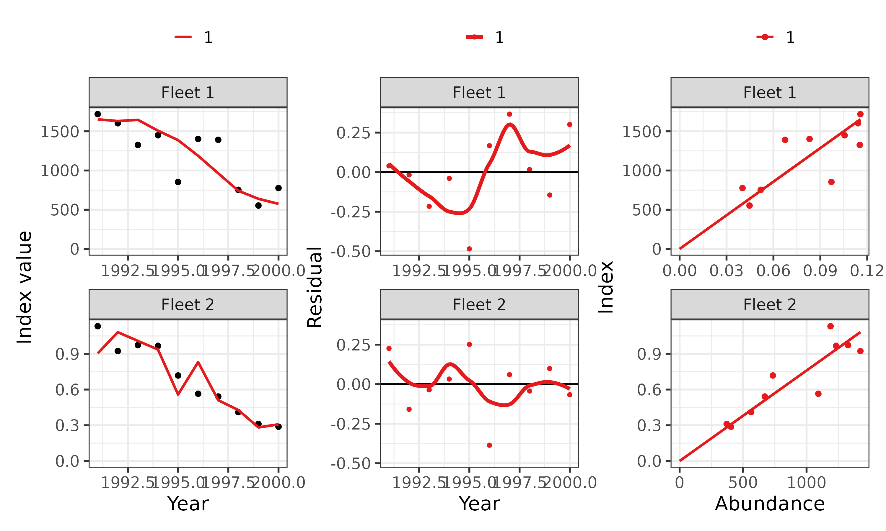

``` r


## catch at age
caa_resid <- caa_plot(res_best); wrap_plots(caa_resid,ncol=2)
```

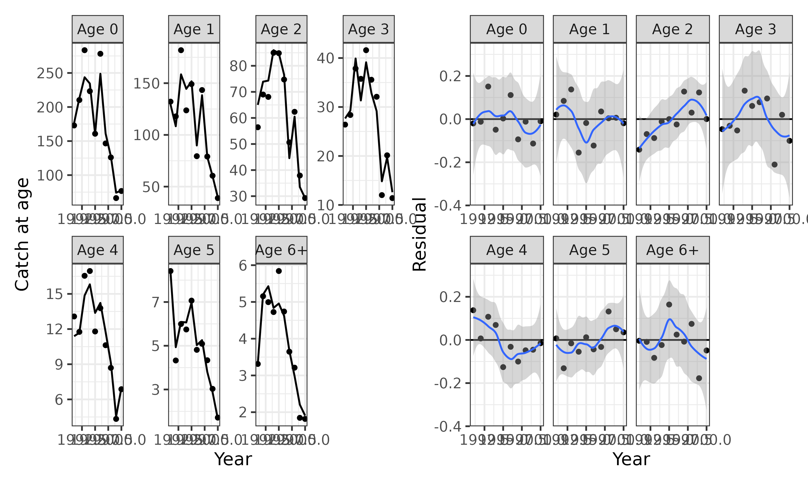

``` r


## total catch weight の比較も必要かも
# 今関数はない

# catch at age (sakai ver.)

caa_obs0 <- dat$caa %>% rownames_to_column(var="Age") %>% pivot_longer(cols=-Age, names_to="Year", values_to="Value") %>% mutate(Data="Observation")
caa_est0 <- res_best$caa %>% as.data.frame %>% rownames_to_column(var="Age") %>% pivot_longer(cols=-Age, names_to="Year", values_to="Value") %>% mutate(Data="Estimation")
caa_obs_est <- bind_rows(caa_obs0, caa_est0)

xlab <- "年齢"
ylab <- "漁獲尾数（百万尾）"
scale <- 1000
g1 <- ggplot() +
  geom_bar(data=caa_obs0, stat="identity", aes(x=Age, y=Value/scale), col="black", fill="#FFFFB3") +
  geom_line(data=caa_est0, aes(x=Age, y=Value/scale, group=Data), col="#F8766D", linewidth=1.5) +
  facet_wrap(~Year, scales = "free_y", nrow=10, dir="v") +
  ylim(c(0, NA)) + scale_x_discrete(limit = c("0", "1", "2", "3", "4", "5", "6", "7", "8+")) +
  theme_bw() + labs(title="CAAプロット(棒グラフ：観測値, 折れ線：推定値)", x=xlab, y=ylab) +
  theme(axis.text.x = element_text(size = 11, color = "black"),
        axis.text.y = element_text(size = 11, color = "black"),
        axis.line.x = element_line(linewidth = 0.3528), axis.line.y = element_line(linewidth = 0.3528),
        axis.minor.ticks.length = rel(0.5), legend.position = "none")
```

### One-Step-Ahead (OSA) residuals

- SAMはランダム効果モデルなので、ハイパーパラメータとランダム効果の推定でデータを二重に使っていることになる
- ランダム効果でデータに対して過度に合わせることも可能であり（過剰適合）、通常の残差を診断に使うのは適切ではないと考えられている
- また、時系列解析なので残差は独立ではないので、独立とみなした診断（QQ
  plotなど）は不適
- あるサンプルを除いた時の予測値（One Step Ahead (OSA)
  prediction）とデータとの残差 (OSA residuals)
  を診断に使うのがより適切らしい
- ’TMB::oneStepPredict’を使って行うが、SAM用の関数’do_osa_resid()’を用意してある

``` r

osa.simple <- do_osa_resid(res_best)
#> [1] 90
#> [1] 89
#> [1] 88
#> [1] 87
#> [1] 86
#> [1] 85
#> [1] 84
#> [1] 83
#> [1] 82
#> [1] 81
#> [1] 80
#> [1] 79
#> [1] 78
#> [1] 77
#> [1] 76
#> [1] 75
#> [1] 74
#> [1] 73
#> [1] 72
#> [1] 71
#> [1] 70
#> [1] 69
#> [1] 68
#> [1] 67
#> [1] 66
#> [1] 65
#> [1] 64
#> [1] 63
#> [1] 62
#> [1] 61
#> [1] 60
#> [1] 59
#> [1] 58
#> [1] 57
#> [1] 56
#> [1] 55
#> [1] 54
#> [1] 53
#> [1] 52
#> [1] 51
#> [1] 50
#> [1] 49
#> [1] 48
#> [1] 47
#> [1] 46
#> [1] 45
#> [1] 44
#> [1] 43
#> [1] 42
#> [1] 41
#> [1] 40
#> [1] 39
#> [1] 38
#> [1] 37
#> [1] 36
#> [1] 35
#> [1] 34
#> [1] 33
#> [1] 32
#> [1] 31
#> [1] 30
#> [1] 29
#> [1] 28
#> [1] 27
#> [1] 26
#> [1] 25
#> [1] 24
#> [1] 23
#> [1] 22
#> [1] 21
#> [1] 20
#> [1] 19
#> [1] 18
#> [1] 17
#> [1] 16
#> [1] 15
#> [1] 14
#> [1] 13
#> [1] 12
#> [1] 11
#> [1] 10
#> [1] 9
#> [1] 8
#> [1] 7
#> [1] 6
#> [1] 5
#> [1] 4
#> [1] 3
#> [1] 2
#> [1] 1
gg_osa = plot_osa_resid(osa.simple); wrap_plots(gg_osa,ncol=2)
```


### レトロスペクティブ解析

- ‘retro_sam()’ という関数で実行可能
- Retrospective forecastingも同時に実行可能でプロットもできる

``` r

retro_res = retro_sam(res_best,n=5) #nは年数

(g_retro = retro_plot(res_best,retro_res,start_year=1991,mohn_position="bottomleft"))
```

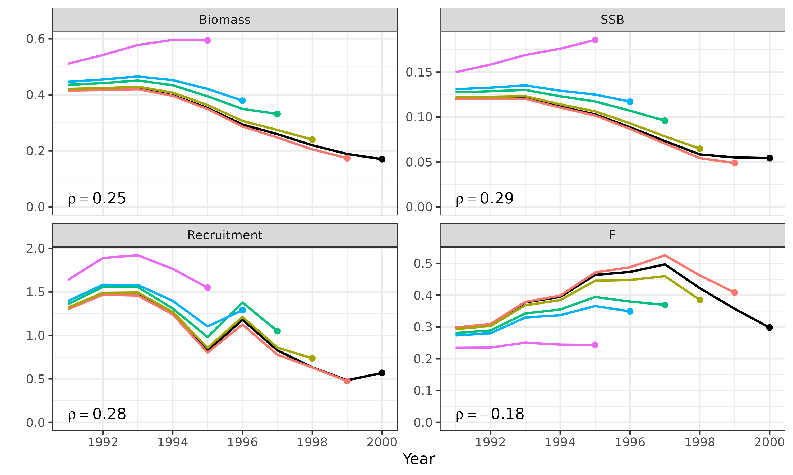

``` r


# retrospective forecastingもできる
(g_retro2 = retro_plot(res_best,retro_res,start_year=1991,mohn_position="bottomleft", forecast=TRUE))
```

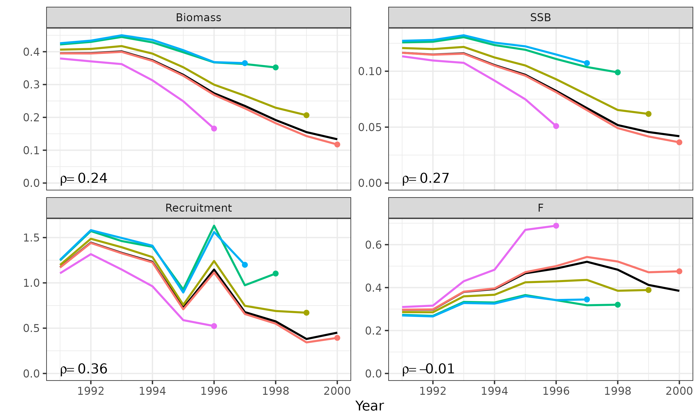

### Hindcast cross validation

- レトロスペクティブ解析で最新のデータを順番に除いていき、除いたIndexを予測するHindcast
  cross validationを実行する
- Mean absolute scaled error (MASE) で予測精度を評価する

``` r

(g_hindcast <- plot_hindcastCV(res_best, retro_res, show_mase = TRUE, mase_position = "bottomleft", use_index = 1:2, log = FALSE))
```

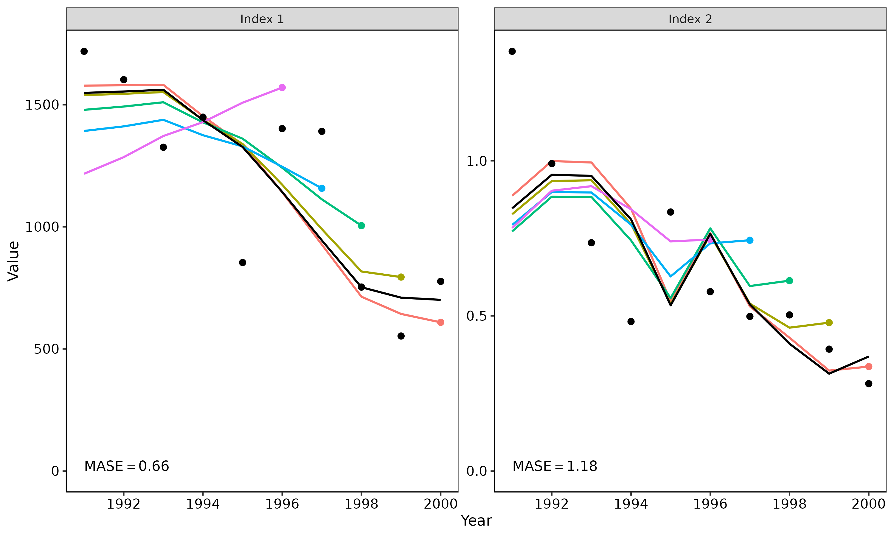

``` r


# MASEの結果を取り出す場合
res_mase = calc_mase(res_best, retro_res, log = FALSE)
res_mase$mase %>% knitr::kable()
```

| idx | index   | denominator |   numerator |      MASE |
|----:|:--------|------------:|------------:|----------:|
|   1 | Index 1 | 324.3231275 | 212.4577530 | 0.6550805 |
|   2 | Index 2 |   0.1126078 |   0.1329216 | 1.1803942 |

### Leave-one-out index analysis

- Indexを一つずつの除いて、推定値の頑健性、影響力のあるIndexを明らかにする（ジャックナイフ解析？）
- ’do_loo_index()’という関数を使って実行する

``` r

loo_res <- do_loo_index(res_best)
reslist <- list()
for ( j in 0:length(loo_res)) {
    if(j==0) {
      reslist[[j+1]] <- res_best
    } else {
      reslist[[j+1]] <- loo_res[[j]]
    }
}
(g_loo <- plot_samvpa(reslist,CI=0,
                    scenario_name = c("full",as.character(-1:-2))))
```

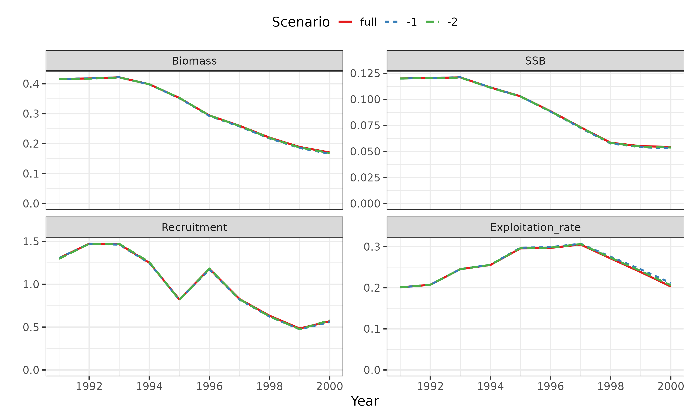

### プロファイル尤度

- Cachability
  qなどを変化させたときの対数尤度を調べて、収束しているか、どの程度尤度が変わるか（不確実性の程度、信頼区間）を調べる

``` r

# Catchabilityに対するプロファイル尤度
# 同じ名前のパラメータが複数ある場合は引数'which_param'で位置を指定できる
res_profile <- samprofile(res_best, "logQ", which_param=1, param_range=c(8, 11), length=25)

# 縦軸は負の対数尤度
res_profile$obj_tbl[-1,] %>%
  ggplot(aes(x=par, y=obj_value)) + geom_line(linewidth=0.5) +
  geom_point(data=res_profile$obj_tbl[1,],colour="red")
```

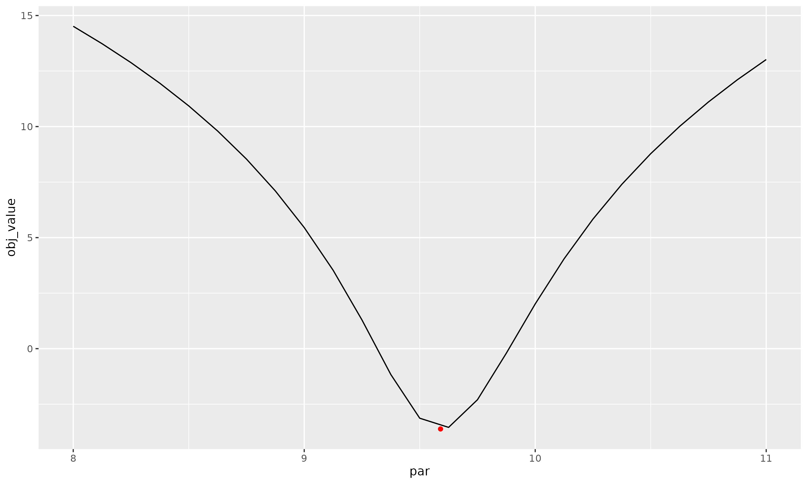

``` r


# Mのプロファイル尤度 => 関数がないからこんな感じで手動で
Ms = seq(0.3,0.7,by=0.1)
scns = str_c("M:",Ms)
samres_Mlist = map(Ms, function(i) {
  res = res_best
  input = res$input
  input$dat$M[] <- i
  # p0_list = res$par_list; input$p0.list <- p0_list #初期値を利用するとき
  res.c = do.call(sam,input)
  return( res.c )
})

data.frame(
  M = Ms,
  obj_value = sapply(samres_Mlist, function(x) x$opt$objective)
) %>% ggplot(aes(x=M,y=obj_value)) + geom_line() + geom_point()
```

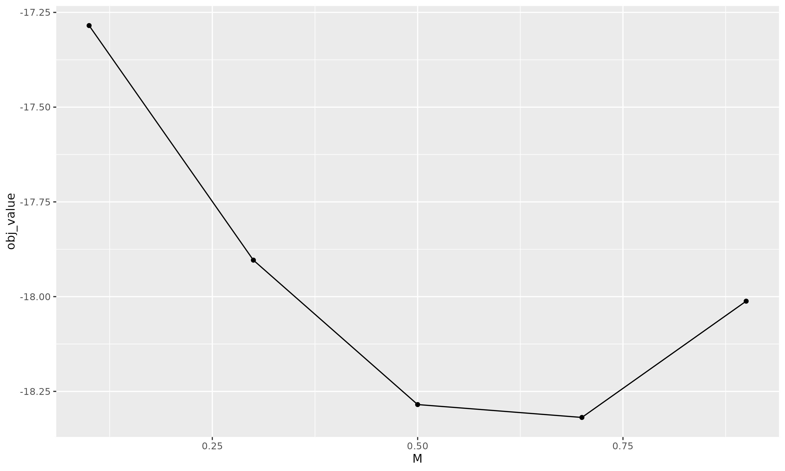

``` r


plot_samvpa(samres_Mlist,scenario_name=scns,CI=0.)
```

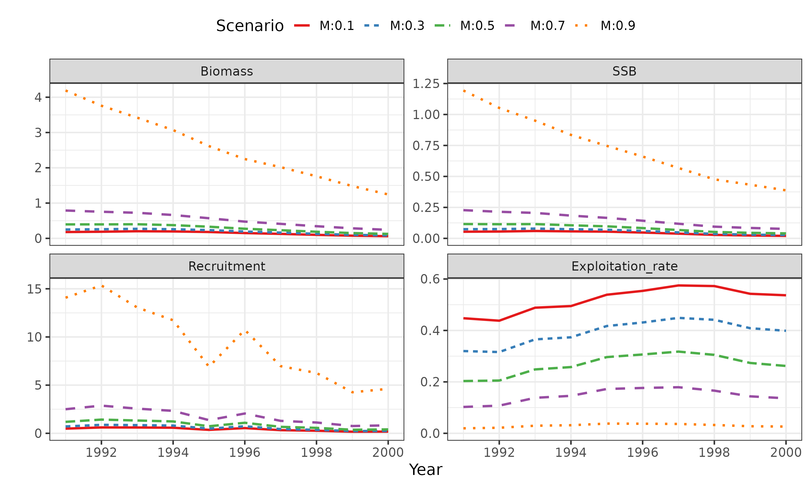

### ブートストラップ

- ’boo_sam()’で実行できる
- ノンパラメトリックブートストラップ（‘method=“n”’）は厳密ではないので、パラメトリックブートストラップを推奨（‘method=“p”’）
- delta法で求めたCIも図に加える場合は’draw_deltaCI=TRUE’

``` r


res_boot <- boo_sam(res_best, n=20,method="p",seed=1) #時間節約のため20回
#> -----1-----
#> -----2-----
#> -----3-----
#> -----4-----
#> -----5-----
#> -----6-----
#> -----7-----
#> -----8-----
#> -----9-----
#> -----10-----
#> -----11-----
#> -----12-----
#> -----13-----
#> -----14-----
#> -----15-----
#> -----16-----
#> -----17-----
#> -----18-----
#> -----19-----
#> -----20-----
(g1 = plot_boosam(res_best,res_boot, CI=0.95, draw_deltaCI = TRUE))
```

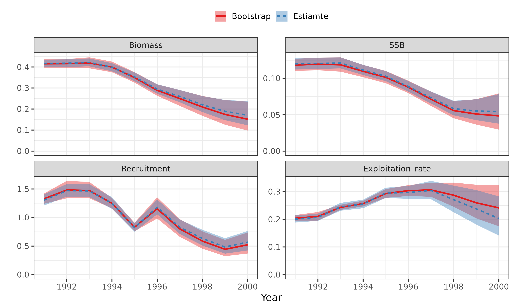

### Self-test / cross test

- 真のモデルをVPA or SAMとして、疑似データを生成し、VPA or
  SAMのモデルを疑似データにフィットさせるというシミュレーションが可能
- 真のモデル (operating model, OM)
  と推定モデルが同じモデルであればselt-test, 異なればcross-test
- VPA or SAMのestimability (self-test), 異なる仮定に対する推定の頑健性
  (cross test) を調べられる

``` r

## 真のモデルはSAM
# pseudo dataを生成
pdata_sam <- popsim_vpasam(res_best, n=20)
# self-test (SAMで推定)
# 前述のブートストラップと同じ（はず）
fit_sam2sam <- fit2PSdata(res_best, PSdata=pdata_sam)
metric_sam2sam = sumup_popsim(res_best,fit_sam2sam) #真のモデルの結果を使うこと
# SSBの要約統計量を出力
metric_sam2sam$summary %>% filter(stat=="SSB") %>% knitr::kable()
```

| stat | year | age | RMSE | MAE | RMSRE | MARE | MedBias | MedRelBias | Median | CV | value_true | lower | upper |
|:---|---:|---:|---:|---:|---:|---:|---:|---:|---:|---:|---:|---:|---:|
| SSB | 1991 | NA | 4.884998 | 3.663427 | 0.0406613 | 0.0304933 | 1.3537110 | 0.0112679 | 121.49255 | 0.0383749 | 120.13884 | 114.70555 | 131.08409 |
| SSB | 1992 | NA | 4.540847 | 3.363335 | 0.0376582 | 0.0278928 | 1.3723064 | 0.0113808 | 121.95301 | 0.0358978 | 120.58070 | 116.14666 | 131.24341 |
| SSB | 1993 | NA | 4.375000 | 3.352421 | 0.0361165 | 0.0276749 | -0.5293270 | -0.0043697 | 120.60641 | 0.0369248 | 121.13573 | 114.34485 | 130.79381 |
| SSB | 1994 | NA | 3.561597 | 2.881931 | 0.0319491 | 0.0258522 | -0.1128494 | -0.0010123 | 111.36422 | 0.0326083 | 111.47707 | 106.02796 | 118.06166 |
| SSB | 1995 | NA | 3.703716 | 2.993384 | 0.0359713 | 0.0290724 | 0.3918567 | 0.0038058 | 103.35487 | 0.0367930 | 102.96301 | 97.26894 | 110.42641 |
| SSB | 1996 | NA | 4.262695 | 3.584928 | 0.0480679 | 0.0404251 | 0.1663521 | 0.0018759 | 88.84702 | 0.0490673 | 88.68066 | 81.72073 | 96.53318 |
| SSB | 1997 | NA | 5.312718 | 4.239520 | 0.0724889 | 0.0578457 | -0.0230767 | -0.0003149 | 73.26706 | 0.0740991 | 73.29014 | 65.63865 | 83.66280 |
| SSB | 1998 | NA | 6.023221 | 4.677428 | 0.1031635 | 0.0801133 | -0.1613256 | -0.0027631 | 58.22387 | 0.1042533 | 58.38519 | 51.47107 | 71.16333 |
| SSB | 1999 | NA | 7.527705 | 5.901405 | 0.1366611 | 0.1071366 | -0.9603477 | -0.0174345 | 54.12268 | 0.1400309 | 55.08302 | 45.43255 | 70.64136 |
| SSB | 2000 | NA | 10.490368 | 8.320407 | 0.1928792 | 0.1529816 | -3.3838432 | -0.0622164 | 51.00445 | 0.1997772 | 54.38829 | 39.79409 | 76.49166 |

``` r

(g_sam2sam <- plot_popsim(res_best,fit_sam2sam))
```

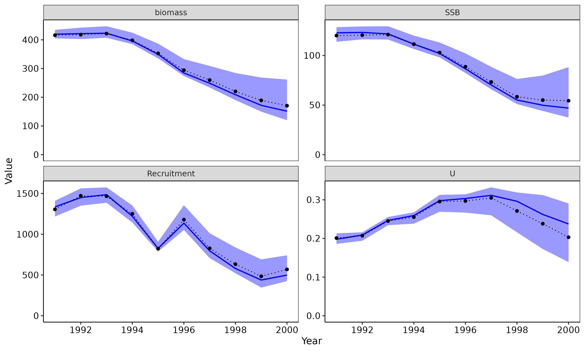

``` r


# cross-test (VPAで推定)
# 前述のブートストラップと同じ（はず）
fit_vpa2sam <- fit2PSdata(res_vpa, PSdata=pdata_sam) #ここでは別のモデルを使う
metric_vpa2sam = sumup_popsim(res_best,fit_vpa2sam) #こっちでは真のモデルの結果を使うこと!
# SSBの要約統計量を出力
metric_vpa2sam$summary %>% filter(stat=="SSB") %>% knitr::kable()
```

| stat | year | age | RMSE | MAE | RMSRE | MARE | MedBias | MedRelBias | Median | CV | value_true | lower | upper |
|:---|---:|---:|---:|---:|---:|---:|---:|---:|---:|---:|---:|---:|---:|
| SSB | 1991 | NA | 7.298953 | 5.905252 | 0.0607543 | 0.0491536 | 5.328397 | 0.0443520 | 125.46723 | 0.0364351 | 120.13884 | 119.45659 | 134.28577 |
| SSB | 1992 | NA | 7.086250 | 6.122929 | 0.0587677 | 0.0507787 | 5.708752 | 0.0473438 | 126.28945 | 0.0345720 | 120.58070 | 118.21208 | 133.52378 |
| SSB | 1993 | NA | 6.299730 | 5.303364 | 0.0520055 | 0.0437803 | 4.680020 | 0.0386345 | 125.81575 | 0.0375055 | 121.13573 | 116.91893 | 134.95106 |
| SSB | 1994 | NA | 5.847248 | 4.686706 | 0.0524525 | 0.0420419 | 3.963163 | 0.0355514 | 115.44024 | 0.0385928 | 111.47707 | 108.04888 | 123.22396 |
| SSB | 1995 | NA | 5.684289 | 4.363654 | 0.0552071 | 0.0423808 | 2.245518 | 0.0218090 | 105.20853 | 0.0397253 | 102.96301 | 100.55969 | 114.52247 |
| SSB | 1996 | NA | 6.335578 | 4.867938 | 0.0714426 | 0.0548929 | 2.607340 | 0.0294015 | 91.28800 | 0.0587139 | 88.68066 | 83.16991 | 101.26145 |
| SSB | 1997 | NA | 7.757605 | 5.774127 | 0.1058479 | 0.0787845 | 1.824599 | 0.0248956 | 75.11474 | 0.0950663 | 73.29014 | 65.78403 | 89.49892 |
| SSB | 1998 | NA | 8.444111 | 6.579890 | 0.1446276 | 0.1126979 | 2.773409 | 0.0475019 | 61.15860 | 0.1291856 | 58.38519 | 52.16083 | 77.92075 |
| SSB | 1999 | NA | 10.212520 | 8.120860 | 0.1854023 | 0.1474294 | 4.383121 | 0.0795730 | 59.46615 | 0.1641767 | 55.08302 | 47.20520 | 78.84774 |
| SSB | 2000 | NA | 12.921209 | 10.411182 | 0.2375733 | 0.1914232 | 4.620889 | 0.0849611 | 59.00918 | 0.2135478 | 54.38829 | 41.55748 | 83.49704 |

``` r

(g_vpa2sam <- plot_popsim(res_best,fit_vpa2sam))
```

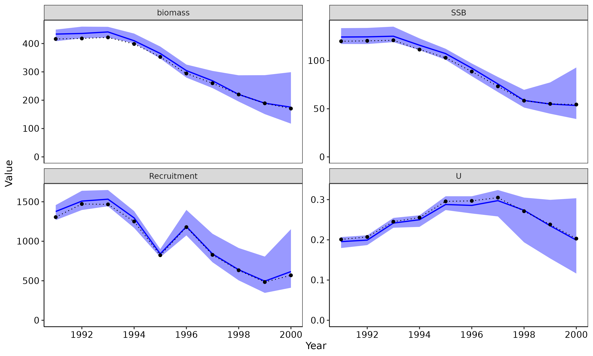

``` r


# SAMの結果（res_best）の代わりに、VPAの結果をoperating model (真のモデル) として入れ替えて、VPAデータに対するself-test / cross-testもできます
```

## 将来予測

- 資源量推定の不確実性をどこまで考慮するか？
- 再生産関係は外部で推定しても良いのかも（難しいことはしなくてもよいようにもしておく）
